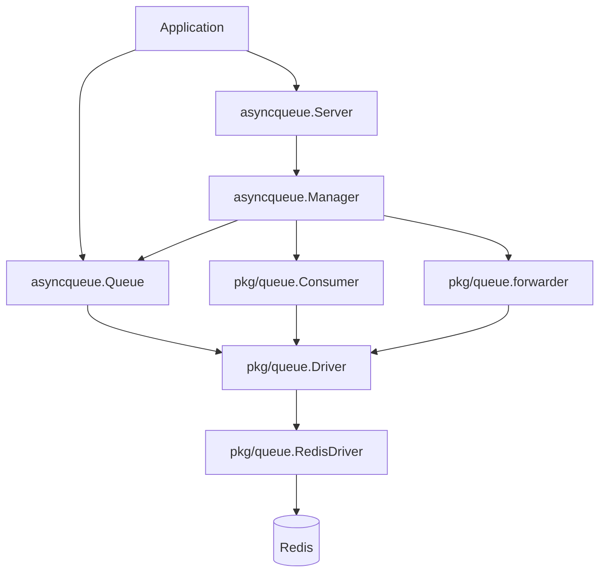
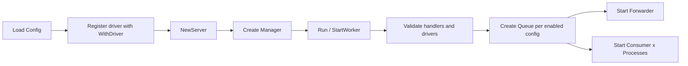
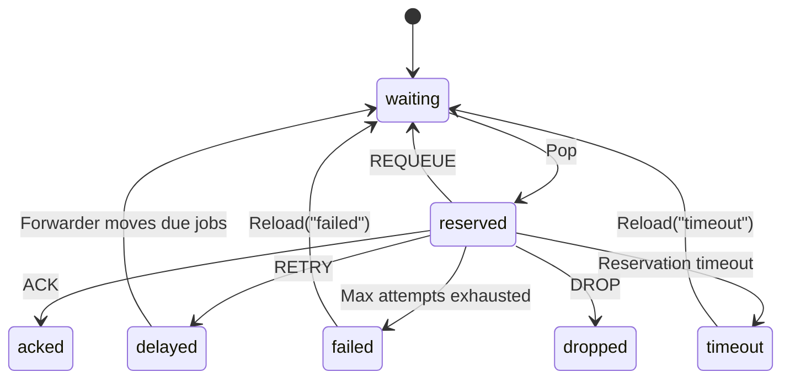

# async-queue-go

English | [简体中文](README.zh-CN.md)

`async-queue-go` is an asynchronous job queue library for Go services. The repository currently ships with a Redis driver and keeps the queue backend behind an extensible `Driver` abstraction.

It exposes two layers:

- High-level runtime APIs: `asyncqueue.Server`, `Manager`, `Queue`
- Low-level building blocks: `pkg/queue.Driver`, `Consumer`, `Forwarder`

The delivery model is at-least-once:

- Jobs are pushed into a waiting queue
- A consumer moves a job into the reserved queue before handling it
- Success leads to `ACK`
- Failures are retried through the delayed queue
- Messages that exceed `max_attempts` move to the failed queue
- Reserved messages that expire move to the timeout queue and can be reloaded manually

## Features

- High-level APIs for business services: `Server`, `ServeMux`, `Queue`
- Pluggable drivers registered by `driver name`
- Built-in Redis driver with delay, timeout recovery, and failed-message reload
- Concurrent consumers with auto-restart and max-message limits
- Queue management APIs for info, delete, retry, reload, and flush
- JSON / YAML configuration support
- Graceful shutdown support

## Use Cases

- Async order processing, coupons, emails, and webhook delivery
- Scheduled retries and compensation flows
- Task systems that need explicit retry, failure, and timeout semantics
- Systems that want to keep the consumption model while replacing the backend implementation

## Installation

Requirements:

- Go `1.21+`
- Redis `6+` or compatible

Install:

```bash
go get github.com/liuxiaozhicn/async-queue-go
```

## Core Concepts

Before using the library, keep these three names separate:

| Concept | Example | Purpose |
| --- | --- | --- |
| `queue name` | `order` | Business queue key used for config lookup, handler binding, and `server.Queue("order")` |
| `driver name` | `redis` | Registered backend name used by `WithDriver("redis", driver)` and the `driver` config field |
| `channel` | `queue:order` | Storage namespace used by the backend; producer and consumer must use the same channel |

The most common mapping is:

- Queue name: `order`
- Driver name: `redis`
- Channel: `queue:order`

Example config:

```json
{
  "queues": {
    "order": {
      "driver": "redis",
      "channel": "queue:order"
    }
  }
}
```

## Quick Start

The recommended path is to use one running `Server` instance for both consuming and publishing:

1. Start a `Server` and register handlers
2. After `server.Run(...)` starts, fetch the queue instance through `server.Queue("order")`
3. Publish jobs with `Queue.PushJob(...)` or `Queue.PushMessage(...)`

### 1. Define a Job

Each job only needs to implement `GetType()` and return its business queue name.

```go
package main

type OrderJob struct {
    OrderID int64   `json:"order_id"`
    UserID  int64   `json:"user_id"`
    Amount  float64 `json:"amount"`
}

func (j *OrderJob) GetType() string {
    return "order"
}
```

### 2. Start the Consumer Side

```go
package main

import (
    "context"
    "encoding/json"
    "log"
    "os/signal"
    "syscall"

    "github.com/liuxiaozhicn/async-queue-go/asyncqueue"
    "github.com/liuxiaozhicn/async-queue-go/pkg/core"
    "github.com/liuxiaozhicn/async-queue-go/pkg/queue"
    "github.com/redis/go-redis/v9"
)

func main() {
    ctx, stop := signal.NotifyContext(context.Background(), syscall.SIGINT, syscall.SIGTERM)
    defer stop()

    cfg := &asyncqueue.Config{
        Queues: map[string]asyncqueue.QueueConfig{
            "order": {
                Driver:          "redis",
                Channel:         "queue:order",
                Enabled:         true,
                PopTimeout:      1,
                HandleTimeout:   30,
                RetrySeconds:    []int{5, 10, 30},
                MessageTTL:      86400,
                MaxAttempts:     3,
                Processes:       2,
                Concurrent:      20,
                ShutdownTimeout: 30,
            },
        },
    }

    redisClient := redis.NewClient(&redis.Options{Addr: "127.0.0.1:6379"})
    defer redisClient.Close()

    server, err := asyncqueue.NewServer(
        cfg,
        asyncqueue.WithDriver("redis", queue.NewRedisDriver(redisClient)),
    )
    if err != nil {
        log.Fatal(err)
    }

    mux := asyncqueue.NewServeMux()
    mux.Handle("order", queue.HandlerFunc(func(ctx context.Context, m *core.Message) (core.Result, error) {
        var job OrderJob
        if err := json.Unmarshal(m.Payload, &job); err != nil {
            return core.DROP, nil
        }

        // Handle business logic here.
        // Need retry:   return core.RETRY, nil
        // Need requeue: return core.REQUEUE, nil
        return core.ACK, nil
    }))

    if err := server.Run(ctx, mux); err != nil {
        log.Fatal(err)
    }
}
```

### 3. Publish from the Same `Server` Instance

If producing and consuming happen in the same process, prefer publishing through the queue instance owned by the running server:

```go
go func() {
    ticker := time.NewTicker(5 * time.Second)
    defer ticker.Stop()

    queueInstance, err := server.Queue("order")
    if err != nil {
        log.Fatal(err)
    }

    for {
        select {
        case <-ctx.Done():
            return
        case <-ticker.C:
            id, err := queueInstance.PushJob(ctx, &OrderJob{
                OrderID: 10001,
                UserID:  20001,
                Amount:  99.9,
            }, 30)
            if err != nil {
                log.Printf("push failed: %v", err)
                continue
            }
            log.Printf("message id = %s", id)
        }
    }
}()
```

This path fits when:

- One service both consumes and produces
- You want to reuse the already-running `Server` / `Manager` / `Queue`
- You do not want to construct another queue wrapper in the same process

Notes:

- `server.Queue("order")` currently depends on the runtime queue instance, so fetch it after `server.Run(...)` starts
- If the process is producer-only and does not start a `Server`, use `NewAsyncQueue(...)` directly

### 4. Create a Queue Directly in a Producer-Only Process

If a process only publishes and does not run workers, you can create a `Queue` directly. This is the lower-level publishing path.

```go
package main

import (
    "context"
    "log"

    "github.com/liuxiaozhicn/async-queue-go/asyncqueue"
    "github.com/liuxiaozhicn/async-queue-go/pkg/queue"
    "github.com/redis/go-redis/v9"
)

func main() {
    ctx := context.Background()

    redisClient := redis.NewClient(&redis.Options{Addr: "127.0.0.1:6379"})
    defer redisClient.Close()

    q, err := asyncqueue.NewAsyncQueue(
        queue.NewRedisDriver(redisClient),
        "queue:order",
        asyncqueue.WithQueueName("order"),
        asyncqueue.WithQueueMessageTTL(86400),
        asyncqueue.WithQueueMaxAttempts(3),
    )
    if err != nil {
        log.Fatal(err)
    }

    id, err := q.PushJob(ctx, &OrderJob{
        OrderID: 10001,
        UserID:  20001,
        Amount:  99.9,
    }, 30)
    if err != nil {
        log.Fatal(err)
    }

    log.Printf("message id = %s", id)
}
```

Notes:

- The example above publishes a job delayed by `30s`
- Producer and consumer must use the same `channel`: `queue:order`
- This path does not depend on `Server` lifecycle
- It is intended for standalone producer services or advanced integrations

## Start from a Config File

### JSON Example

```json
{
  "queues": {
    "order": {
      "driver": "redis",
      "channel": "queue:order",
      "enabled": true,
      "pop_timeout": 1,
      "handle_timeout": 30,
      "retry_seconds": [5, 10, 30],
      "message_ttl": 86400,
      "max_attempts": 3,
      "processes": 2,
      "concurrent": 20,
      "max_messages": 0,
      "auto_restart": false,
      "shutdown_timeout": 30
    }
  }
}
```

### Load Config File

```go
redisClient := redis.NewClient(&redis.Options{Addr: "127.0.0.1:6379"})

server, err := asyncqueue.LoadServer(
    "config.json",
    asyncqueue.WithDriver("redis", queue.NewRedisDriver(redisClient)),
)
if err != nil {
    log.Fatal(err)
}
```

Important:

- `LoadConfig` / `LoadServer` fills config defaults automatically
- If you build `Config` directly in Go code, set `Driver` and the runtime fields explicitly instead of relying on file-loading defaults

## Handler Result Semantics

`pkg/core.Result` defines four outcomes:

| Result | Meaning |
| --- | --- |
| `core.ACK` | Success; remove the message from the reserved queue |
| `core.RETRY` | Send the message to the delayed queue with retry policy |
| `core.REQUEUE` | Move the message back to the waiting queue immediately |
| `core.DROP` | Drop the message without retry |

Additional notes:

- If the handler returns `error`, the framework follows the error path instead of the explicit `Result`
- If attempts remain, the message goes to retry
- Once `MaxAttempts` is exhausted, the message moves to the failed queue

## Architecture

### Layered View



### Startup Flow



### Message Lifecycle



### Detailed Flow

```mermaid
flowchart TD
    P[Producer PushJob / PushMessage] --> Q{delaySeconds > 0?}
    Q -- No --> W[waiting]
    Q -- Yes --> D[delayed]

    D -->|Delay expires<br/>Forwarder moves message| W

    W -->|Consumer Pop| R[reserved]

    R -->|Handler returns ACK| ACK[done / removed from active queues]
    R -->|Handler returns DROP| DROP[dropped / removed from active queues]
    R -->|Handler returns REQUEUE| W

    R -->|Handler returns RETRY<br/>and attempts < maxAttempts| D
    R -->|Handler returns RETRY<br/>and attempts >= maxAttempts| F[failed]

    R -->|Handler returns error or panic<br/>and attempts < maxAttempts| D
    R -->|Handler returns error or panic<br/>and attempts >= maxAttempts| F

    R -->|Exceeds handleTimeout<br/>and Forwarder detects expired reservation| T[timeout]

    T -->|Manual Reload('timeout')| W
    F -->|Manual Reload('failed')| W
```

Notes:

- `waiting` is the main consumable queue
- `reserved` means the message has been claimed by a consumer but not committed yet
- `delayed` is used for both intentional delays and retry backoff
- `timeout` does not return to `waiting` automatically; call `Reload("timeout")`
- `failed` does not auto-retry; it is intended for inspection, compensation, or replay
- Whether an `ACK`ed or `DROP`ped message can still be queried depends on `message_ttl`

### Runtime Responsibilities

| Component | Responsibility |
| --- | --- |
| `Server` | High-level entry point for config, driver registration, handlers, and lifecycle |
| `Manager` | Creates queues, consumers, and forwarders from config and manages startup/shutdown |
| `Queue` | Producer-facing API for publish, query, delete, retry, reload, and stats |
| `Consumer` | Consumption loop that calls handlers and commits ACK / RETRY / REQUEUE / DROP |
| `Forwarder` | Background mover for delayed jobs and expired reservations |
| `Driver` | Backend abstraction for queue operations and state transitions |
| `RedisDriver` | Built-in backend implementation |

## Redis Storage Model

The Redis driver generates a key set per `channel`:

```text
{queue:order}:waiting
{queue:order}:reserved
{queue:order}:delayed
{queue:order}:timeout
{queue:order}:failed
{queue:order}:message:<id>
{queue:order}:msg_seq
{queue:order}:msg_seq_epoch
```

Meaning:

- `waiting`: ready-to-consume queue
- `reserved`: claimed but not yet committed
- `delayed`: delayed and retry messages
- `timeout`: expired reservations
- `failed`: messages that exhausted retries
- `message:<id>`: message entity payload
- `msg_seq` / `msg_seq_epoch`: message id sequence state

The `{...}` hash tag keeps all keys for one business queue in the same Redis Cluster slot.

## Configuration Reference

`asyncqueue.QueueConfig` fields:

| Field | Default | Meaning |
| --- | --- | --- |
| `driver` | `redis` (only auto-filled when loading from file) | Driver name used to look up `WithDriver(name, driver)` registrations |
| `channel` | none | Backend storage channel; must match the producer side |
| `enabled` | `false` | Whether the queue is enabled |
| `pop_timeout` | `1` | Empty-poll timeout in seconds |
| `handle_timeout` | `10` | Per-message handling timeout in seconds |
| `retry_seconds` | `[5]` | Retry backoff sequence; the last element is reused when exhausted |
| `message_ttl` | `864000` | Message entity TTL in seconds |
| `max_attempts` | `3` | Maximum delivery attempts |
| `processes` | `1` | Number of consumer instances started in-process |
| `concurrent` | `10` | Concurrency per consumer instance |
| `max_messages` | `0` | Max messages processed by one consumer; `0` means unlimited |
| `auto_restart` | `false` | Whether to restart a worker after hitting `max_messages` |
| `shutdown_timeout` | `30` | Graceful shutdown timeout in seconds |

Notes:

- `max_messages` is commonly used together with `auto_restart=true`
- When creating `Config` directly in Go code, set `driver` explicitly
- Multiple queues may reuse the same driver instance; the current Redis driver is isolated by `channel` at runtime

## Recommended Usage Modes

### Mode 1: High-Level Service Mode

Best for services that both consume and publish:

- Use `LoadServer` or `NewServer`
- Register handlers through `ServeMux`
- Register the backend through `WithDriver("redis", queue.NewRedisDriver(client))`
- Publish through `server.Queue("order").PushJob(...)`

Advantages:

- Complete lifecycle management
- Clear configuration-driven wiring
- Automatic forwarder and multiple consumer startup

### Mode 2: Producer-Only Mode

Best for API gateways or producer-only services:

- Use `NewAsyncQueue`
- Publish with `PushJob` or `PushMessage`

Advantages:

- No worker runtime required
- Independent from `Server` lifecycle
- Easier to deploy separately from consumers

## Queue Management APIs

`Queue` exposes:

| Method | Purpose |
| --- | --- |
| `PushJob(ctx, job, delaySeconds)` | Publish a structured job |
| `PushMessage(ctx, msg, delaySeconds)` | Publish a raw message |
| `Info(ctx)` | Read waiting / reserved / delayed / timeout / failed counts |
| `GetMessage(ctx, id)` | Fetch message details |
| `DeleteMessage(ctx, msg)` | Delete by message entity |
| `DeleteByID(ctx, id)` | Delete by message id |
| `RetryByID(ctx, id, delaySeconds)` | Retry a message with a new delay |
| `Reload(ctx, "timeout"|"failed")` | Move timeout or failed messages back to waiting |
| `Flush(ctx, queueName)` | Clear one internal queue |

Notes:

- `Reload` only supports `"timeout"` and `"failed"`
- `Flush` supports `waiting`, `reserved`, `delayed`, `timeout`, and `failed`
- `GetMessage`, `DeleteByID`, and `RetryByID` depend on optional driver capabilities; the current Redis driver supports them

## Advanced Usage

### Custom Logger

```go
server, err := asyncqueue.NewServer(
    cfg,
    asyncqueue.WithDriver("redis", queue.NewRedisDriver(redisClient)),
    asyncqueue.WithLogger(logger.Default.LogMode(logger.Warn)),
)
```

### Global Default Server

`NewServer(...)` sets the instance as the default server, so you can use:

```go
id, err := asyncqueue.Push(ctx, "order", job, 0)
```

Notes:

- This only works after the default server is created and the queue has started
- This is convenience sugar, not the primary recommended API
- For producer-only processes, prefer `NewAsyncQueue`

### Use the Low-Level Consumer Directly

If you do not want `Server` / `Manager`, you can compose the runtime yourself:

- `queue.NewRedisDriver(...)`
- `queue.NewConsumer(...)`
- `worker.NewWorker(...)`

Reference:

- [`examples/worker/main.go`](examples/worker/main.go)

## Custom Driver Extension

The repository currently includes Redis, but the architecture allows other backends.

You need to implement:

```go
type Driver interface {
    Ping(ctx context.Context) error
    Push(ctx context.Context, channel string, m *core.Message, delaySeconds int, messageTTL int) error
    Delete(ctx context.Context, channel string, m *core.Message) error
    Pop(ctx context.Context, channel string, popTimeout time.Duration, handleTimeout time.Duration) (string, *core.Message, error)
    Remove(ctx context.Context, channel string, messageID string) error
    Ack(ctx context.Context, channel string, messageID string) error
    Fail(ctx context.Context, channel string, messageID string) error
    Requeue(ctx context.Context, channel string, messageID string) error
    Retry(ctx context.Context, channel string, m *core.Message, retrySeconds []int) error
    Reload(ctx context.Context, channel string, queue string) (int, error)
    Flush(ctx context.Context, channel string, queue string) error
    Info(ctx context.Context, channel string) (Info, error)
}
```

Optional capabilities:

- `MessageReader`
- `MessageWriter`
- `MessageForwarder`

Registration:

```go
server, err := asyncqueue.NewServer(
    cfg,
    asyncqueue.WithDriver("custom", customDriver),
)
```

Config:

```json
{
  "queues": {
    "order": {
      "driver": "custom",
      "channel": "queue:order",
      "enabled": true
    }
  }
}
```

## Project Layout

```text
async-queue-go/
├── asyncqueue/          # High-level APIs: Server / Manager / Queue / Config
├── pkg/core/            # Message model, statuses, retry helpers
├── pkg/queue/           # Driver / Consumer / Forwarder / RedisDriver
├── pkg/worker/          # Worker lifecycle wrapper
├── pkg/logger/          # Default logger and interface
├── examples/demo/       # High-level end-to-end example
├── examples/worker/     # Low-level Consumer example
├── README.md            # English documentation
└── README.zh-CN.md      # Chinese documentation
```

## Examples

High-level example:

- [`examples/demo/main.go`](examples/demo/main.go)
- [`examples/demo/config.json`](examples/demo/config.json)

Low-level worker example:

- [`examples/worker/main.go`](examples/worker/main.go)

Run the demo:

```bash
go run ./examples/demo
```

Run the low-level worker example:

```bash
go run ./examples/worker --redis-addr 127.0.0.1:6379 --channel queue:order
```

## Testing

Run all tests:

```bash
go test ./...
```

Compile-only validation:

```bash
go test ./... -run TestDoesNotExist -count=1
```

Redis-related tests require a reachable Redis instance, commonly:

```text
127.0.0.1:6379
```

## FAQ

### 1. Why is `driver` in config not the queue name?

Because `driver` identifies the backend implementation, not the business queue.

Example:

- Queue name: `order`
- Driver name: `redis`
- Channel: `queue:order`

You bind handlers by `order`, while the runtime resolves the backend through `redis`.

### 2. Why can one `RedisDriver` serve multiple queues?

Because the current `Driver` interface receives `channel` on every operation, so the driver no longer binds to a single queue at construction time.

### 3. How do I move failed messages back into the queue?

Use:

```go
count, err := q.Reload(ctx, "failed")
```

Or reload timeout messages:

```go
count, err := q.Reload(ctx, "timeout")
```

### 4. Which fields must stay consistent when producers and consumers are deployed separately?

At minimum:

- `channel`
- `max_attempts`
- `message_ttl`
- `retry_seconds`

`channel` is especially critical. If it differs, producer and consumer are not operating on the same backend keys.

### 5. Why not expose `Server.Push` directly?

Because publishing is already the responsibility of `Queue`, while `Server` is better kept as the runtime entry point and queue lookup layer.

Recommended usage:

```go
queueInstance, err := server.Queue("order")
id, err := queueInstance.PushJob(ctx, job, 0)
```

This keeps responsibilities clear:

- `Server` resolves the runtime queue instance
- `Queue` owns publish, query, delete, and retry operations
- No extra façade is added on top of `Server`

## Current Status

Current repository state:

- Redis driver is built in
- The high-level `Server` mode is ready for business services
- The low-level `Consumer` / `Driver` layer is available for extension and custom runtime composition
