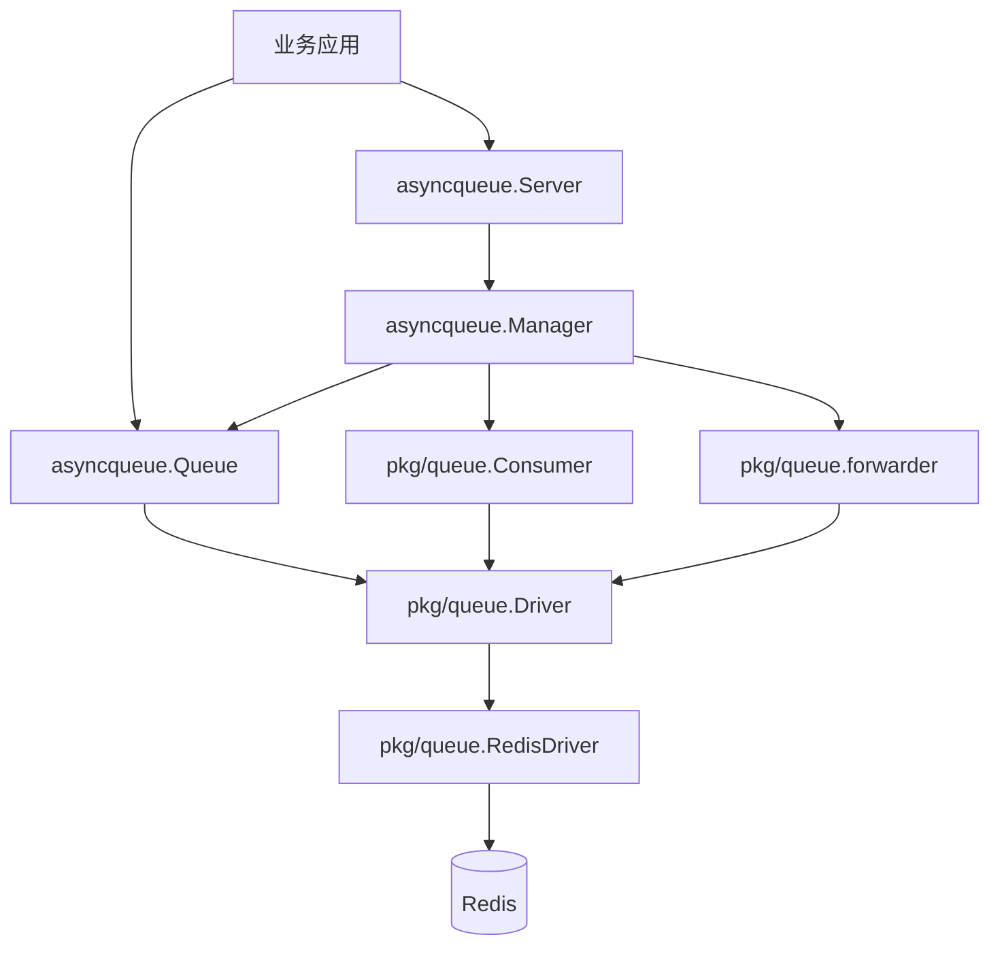
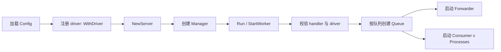
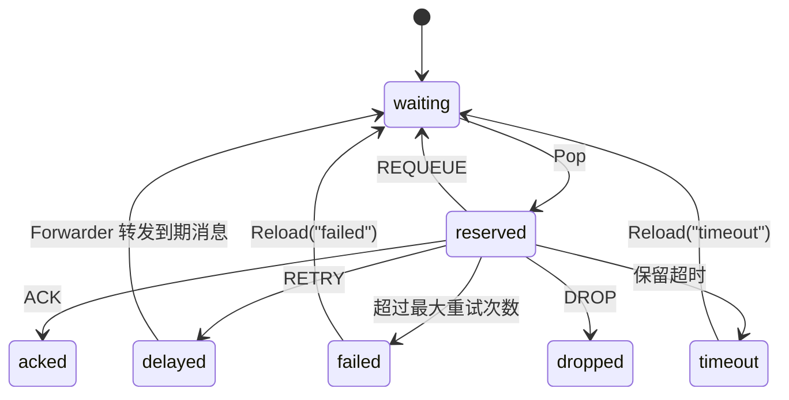

# async-queue-go

[English](README.md) | 简体中文

`async-queue-go` 是一个面向 Go 服务的异步任务队列库，当前仓库内置 Redis 驱动实现，并保留了可扩展的 `Driver` 抽象。

它提供两层能力：

- 高层：`asyncqueue.Server` / `Manager` / `Queue`，适合业务服务直接接入
- 低层：`pkg/queue.Driver` / `Consumer` / `Forwarder`，适合自己编排运行时

当前语义是标准的 at-least-once 投递模型：

- 任务会先进入等待队列
- 消费时进入保留队列
- 成功 `ACK`
- 失败后按重试策略进入延迟队列
- 超过最大重试次数后进入失败队列
- 保留超时的任务会进入超时队列，之后可手动重装载

## 特性

- 面向业务的高层 API：`Server`、`ServeMux`、`Queue`
- 驱动可插拔，按 `driver name` 注册和绑定
- 当前内置 Redis 驱动实现，支持延迟、超时恢复、失败重载
- 消费者支持并发处理、自动重启、最大消息数控制
- 提供消息查询、删除、重试、队列统计等管理能力
- 支持 JSON / YAML 配置文件
- 支持优雅停机

## 适用场景

- Web 服务中的异步下单、发券、发送邮件、Webhook 投递
- 定时重试或失败补偿
- 需要在业务层明确控制重试策略、失败队列、消息状态的任务系统
- 需要自己扩展后端驱动，但仍保留统一消费模型的系统

## 安装

要求：

- Go `1.21+`
- Redis `6+` 或兼容版本

安装模块：

```bash
go get github.com/liuxiaozhicn/async-queue-go
```

## 核心概念

在使用前，先区分 3 个概念：

| 概念 | 示例 | 作用 |
| --- | --- | --- |
| `queue name` | `order` | 业务队列名，用于配置项 key、handler 注册、`server.Queue("order")` |
| `driver name` | `redis` | 驱动注册名，用于 `WithDriver("redis", driver)` 和配置中的 `driver` 字段 |
| `channel` | `queue:order` | 存储命名空间，用于后端实际读写，生产端和消费端必须一致 |

最常见的组合是：

- 队列名：`order`
- 驱动名：`redis`
- Channel：`queue:order`

配置里通常是：

```json
{
  "queues": {
    "order": {
      "driver": "redis",
      "channel": "queue:order"
    }
  }
}
```

## 快速开始

推荐优先使用同一个 `Server` 运行实例完成消费和投递：

1. 启动 `Server`，注册 handler
2. `server.Run(...)` 启动后，通过 `server.Queue("order")` 获取队列实例
3. 使用 `Queue.PushJob(...)` / `Queue.PushMessage(...)` 投递任务

### 1. 定义 Job

每个业务任务只需要实现 `GetType()`，返回它所属的业务队列名。

```go
package main

type OrderJob struct {
    OrderID int64   `json:"order_id"`
    UserID  int64   `json:"user_id"`
    Amount  float64 `json:"amount"`
}

func (j *OrderJob) GetType() string {
    return "order"
}
```

### 2. 启动消费端

```go
package main

import (
    "context"
    "encoding/json"
    "log"
    "os/signal"
    "syscall"

    "github.com/liuxiaozhicn/async-queue-go/asyncqueue"
    "github.com/liuxiaozhicn/async-queue-go/pkg/core"
    "github.com/liuxiaozhicn/async-queue-go/pkg/queue"
    "github.com/redis/go-redis/v9"
)

func main() {
    ctx, stop := signal.NotifyContext(context.Background(), syscall.SIGINT, syscall.SIGTERM)
    defer stop()

    cfg := &asyncqueue.Config{
        Queues: map[string]asyncqueue.QueueConfig{
            "order": {
                Driver:          "redis",
                Channel:         "queue:order",
                Enabled:         true,
                PopTimeout:      1,
                HandleTimeout:   30,
                RetrySeconds:    []int{5, 10, 30},
                MessageTTL:      86400,
                MaxAttempts:     3,
                Processes:       2,
                Concurrent:      20,
                ShutdownTimeout: 30,
            },
        },
    }

    redisClient := redis.NewClient(&redis.Options{Addr: "127.0.0.1:6379"})
    defer redisClient.Close()

    server, err := asyncqueue.NewServer(
        cfg,
        asyncqueue.WithDriver("redis", queue.NewRedisDriver(redisClient)),
    )
    if err != nil {
        log.Fatal(err)
    }

    mux := asyncqueue.NewServeMux()
    mux.Handle("order", queue.HandlerFunc(func(ctx context.Context, m *core.Message) (core.Result, error) {
        var job OrderJob
        if err := json.Unmarshal(m.Payload, &job); err != nil {
            return core.DROP, nil
        }

        // 在这里处理业务逻辑
        // 如果需要重试：return core.RETRY, nil
        // 如果需要立即重新入队：return core.REQUEUE, nil
        return core.ACK, nil
    }))

    if err := server.Run(ctx, mux); err != nil {
        log.Fatal(err)
    }
}
```

### 3. 在同一个 Server 实例里投递任务

如果你的生产逻辑和消费逻辑在同一个进程内，推荐直接从 `Server` 获取已经运行中的队列实例：

```go
go func() {
    ticker := time.NewTicker(5 * time.Second)
    defer ticker.Stop()

    queueInstance, err := server.Queue("order")
    if err != nil {
        log.Fatal(err)
    }

    for {
        select {
        case <-ctx.Done():
            return
        case <-ticker.C:
            id, err := queueInstance.PushJob(ctx, &OrderJob{
                OrderID: 10001,
                UserID:  20001,
                Amount:  99.9,
            }, 30)
            if err != nil {
                log.Printf("push failed: %v", err)
                continue
            }
            log.Printf("message id = %s", id)
        }
    }
}()
```

这个方式适合：

- 同一个服务既消费也生产
- 希望复用已经启动好的 `Server` / `Manager` / `Queue` 运行实例
- 不想在同进程里额外再创建一个独立 `Queue`

注意：

- `server.Queue("order")` 当前依赖运行中的队列实例，所以要在 `server.Run(...)` 启动后再获取
- 如果你只是纯生产者进程，没有启动 `Server`，再使用低层 `NewAsyncQueue(...)`

### 4. 纯生产者进程直接创建 Queue

如果你的进程只负责投递，不负责消费，可以直接创建 `Queue`。这是低层方式，适合独立生产者服务：

```go
package main

import (
    "context"
    "log"

    "github.com/liuxiaozhicn/async-queue-go/asyncqueue"
    "github.com/liuxiaozhicn/async-queue-go/pkg/queue"
    "github.com/redis/go-redis/v9"
)

func main() {
    ctx := context.Background()

    redisClient := redis.NewClient(&redis.Options{Addr: "127.0.0.1:6379"})
    defer redisClient.Close()

    q, err := asyncqueue.NewAsyncQueue(
        queue.NewRedisDriver(redisClient),
        "queue:order",
        asyncqueue.WithQueueName("order"),
        asyncqueue.WithQueueMessageTTL(86400),
        asyncqueue.WithQueueMaxAttempts(3),
    )
    if err != nil {
        log.Fatal(err)
    }

    id, err := q.PushJob(ctx, &OrderJob{
        OrderID: 10001,
        UserID:  20001,
        Amount:  99.9,
    }, 30)
    if err != nil {
        log.Fatal(err)
    }

    log.Printf("message id = %s", id)
}
```

说明：

- 上面投递的是一个延迟 `30s` 执行的任务
- 消费端和生产端使用的是同一个 `channel`：`queue:order`
- 这种方式不依赖 `Server` 是否启动
- 这属于低层投递方式，适合独立生产者进程或高级封装场景

## 使用配置文件启动

### JSON 配置示例

```json
{
  "queues": {
    "order": {
      "driver": "redis",
      "channel": "queue:order",
      "enabled": true,
      "pop_timeout": 1,
      "handle_timeout": 30,
      "retry_seconds": [5, 10, 30],
      "message_ttl": 86400,
      "max_attempts": 3,
      "processes": 2,
      "concurrent": 20,
      "max_messages": 0,
      "auto_restart": false,
      "shutdown_timeout": 30
    }
  }
}
```

### 配置文件加载方式

```go
redisClient := redis.NewClient(&redis.Options{Addr: "127.0.0.1:6379"})

server, err := asyncqueue.LoadServer(
    "config.json",
    asyncqueue.WithDriver("redis", queue.NewRedisDriver(redisClient)),
)
if err != nil {
    log.Fatal(err)
}
```

重要说明：

- 通过 `LoadConfig` / `LoadServer` 加载配置文件时，会自动补默认值
- 如果你是直接在 Go 代码里手写 `Config`，请显式填写 `Driver` 和各项运行参数，不要依赖配置文件默认值补齐逻辑

## Handler 返回值语义

`pkg/core.Result` 定义了 4 种处理结果：

| 返回值 | 含义 |
| --- | --- |
| `core.ACK` | 成功完成，消息从保留队列移除 |
| `core.RETRY` | 按重试策略进入延迟队列 |
| `core.REQUEUE` | 立即重新回到等待队列 |
| `core.DROP` | 直接丢弃，不再处理 |

补充说明：

- 如果 handler 返回 `error`，框架会走失败处理逻辑，而不是使用返回的 `Result`
- 有剩余尝试次数时会进入重试
- 超过 `MaxAttempts` 后会进入失败队列

## 架构说明

### 分层结构



### 启动流程



### 消息生命周期



### 详细状态流转图

```mermaid
flowchart TD
    P[Producer PushJob / PushMessage] --> Q{delaySeconds > 0?}
    Q -- 否 --> W[waiting]
    Q -- 是 --> D[delayed]

    D -->|延迟到期后<br/>Forwarder 转发| W

    W -->|Consumer Pop| R[reserved]

    R -->|Handler 返回 ACK| ACK[done / 从活动队列移除]
    R -->|Handler 返回 DROP| DROP[dropped / 从活动队列移除]
    R -->|Handler 返回 REQUEUE| W

    R -->|Handler 返回 RETRY<br/>且 attempts < maxAttempts| D
    R -->|Handler 返回 RETRY<br/>且 attempts >= maxAttempts| F[failed]

    R -->|Handler 返回 error 或 panic<br/>且 attempts < maxAttempts| D
    R -->|Handler 返回 error 或 panic<br/>且 attempts >= maxAttempts| F

    R -->|超过 handleTimeout<br/>且 Forwarder 检测到超时保留消息| T[timeout]

    T -->|手动 Reload('timeout')| W
    F -->|手动 Reload('failed')| W
```

补充说明：

- `waiting` 是可被消费的主入口队列
- `reserved` 表示消息已经被某个 consumer 取走，但还没有最终提交结果
- `delayed` 既包括生产时主动延迟的消息，也包括消费失败后的重试消息
- `timeout` 不会自动回到 `waiting`，需要业务或运维侧显式调用 `Reload("timeout")`
- `failed` 也不会自动重试，通常用于人工检查、补偿或定向重放
- `ACK` 和 `DROP` 都会把消息从活动流转队列中移除，之后消息实体是否仍可查询取决于 `message_ttl`

### 运行职责划分

| 组件 | 职责 |
| --- | --- |
| `Server` | 高层入口，聚合配置、driver 注册、handler 注册、生命周期管理 |
| `Manager` | 根据配置创建队列、消费者、forwarder，并管理启停 |
| `Queue` | 生产侧 API，负责投递、查询、删除、重试、统计 |
| `Consumer` | 消费循环，负责调用 handler 并提交 ACK / RETRY / REQUEUE / DROP |
| `Forwarder` | 后台搬运到期延迟消息和超时保留消息 |
| `Driver` | 后端抽象层，定义队列读写与状态转换能力 |
| `RedisDriver` | 当前内置后端实现 |

## Redis 存储模型

当前 Redis 驱动会按 `channel` 生成一组 key：

```text
{queue:order}:waiting
{queue:order}:reserved
{queue:order}:delayed
{queue:order}:timeout
{queue:order}:failed
{queue:order}:message:<id>
{queue:order}:msg_seq
{queue:order}:msg_seq_epoch
```

说明：

- `waiting`：等待消费的消息队列
- `reserved`：已弹出但尚未确认的消息
- `delayed`：延迟消息
- `timeout`：处理超时恢复出来的消息
- `failed`：重试耗尽的消息
- `message:<id>`：消息实体
- `msg_seq` / `msg_seq_epoch`：消息 ID 生成序列

`{...}` 哈希标签用于保证同一业务队列相关 key 落在相同 hash slot，适合 Redis Cluster 场景。

## 配置说明

`asyncqueue.QueueConfig` 字段如下：

| 字段 | 默认值 | 说明 |
| --- | --- | --- |
| `driver` | `redis`（仅配置文件加载时自动补） | 用于从 `WithDriver(name, driver)` 注册表中取 driver |
| `channel` | 无 | 后端实际存储通道，必须和生产端一致 |
| `enabled` | `false` | 是否启用该队列 |
| `pop_timeout` | `1` | 空轮询等待秒数 |
| `handle_timeout` | `10` | 单条消息处理超时秒数 |
| `retry_seconds` | `[5]` | 重试退避序列；超过长度后复用最后一个值 |
| `message_ttl` | `864000` | 消息实体 TTL，单位秒 |
| `max_attempts` | `3` | 最大尝试次数 |
| `processes` | `1` | 进程内启动的消费者实例数 |
| `concurrent` | `10` | 每个消费者实例的并发度 |
| `max_messages` | `0` | 单个消费者处理上限；`0` 表示不限制 |
| `auto_restart` | `false` | 达到 `max_messages` 后是否自动重启 worker |
| `shutdown_timeout` | `30` | 优雅停机等待秒数 |

注意：

- `max_messages` 通常和 `auto_restart=true` 配合使用
- 直接在 Go 代码中创建 `Config` 时，请显式设置 `driver`
- 如果一个 driver 名称在多个队列里复用，它们可以共享同一个 driver 实例；当前 RedisDriver 已经是按 `channel` 运行时隔离

## 推荐使用模式

### 模式一：高层服务模式

适合同进程消费和投递的业务服务：

- 使用 `LoadServer` / `NewServer`
- 使用 `ServeMux` 注册 handler
- 使用 `WithDriver("redis", queue.NewRedisDriver(client))` 注册驱动
- 通过 `server.Queue("order").PushJob(...)` 投递任务

优点：

- 生命周期完整
- 配置驱动清晰
- 自动启动 forwarder 和多个 consumer

### 模式二：纯生产者模式

适合 API 服务或业务网关：

- 使用 `NewAsyncQueue`
- 直接 `PushJob` / `PushMessage`

优点：

- 不需要启动 worker
- 不依赖 `Server` 是否运行
- 更适合和消费服务解耦部署

## 管理能力

`Queue` 提供以下能力：

| 方法 | 说明 |
| --- | --- |
| `PushJob(ctx, job, delaySeconds)` | 投递结构化任务 |
| `PushMessage(ctx, msg, delaySeconds)` | 投递原始消息 |
| `Info(ctx)` | 获取 waiting / reserved / delayed / timeout / failed 统计 |
| `GetMessage(ctx, id)` | 获取消息详情 |
| `DeleteMessage(ctx, msg)` | 按消息实体删除 |
| `DeleteByID(ctx, id)` | 按 message id 删除 |
| `RetryByID(ctx, id, delaySeconds)` | 重新设定延迟后重试 |
| `Reload(ctx, "timeout"|"failed")` | 将超时或失败消息重新放回 waiting |
| `Flush(ctx, queueName)` | 清空指定内部队列 |

说明：

- `Reload` 只支持 `"timeout"` 和 `"failed"`
- `Flush` 支持 `waiting` / `reserved` / `delayed` / `timeout` / `failed`
- `GetMessage` / `DeleteByID` / `RetryByID` 依赖 driver 实现对应的可选能力；当前 RedisDriver 已支持

## 高级用法

### 自定义 logger

```go
server, err := asyncqueue.NewServer(
    cfg,
    asyncqueue.WithDriver("redis", queue.NewRedisDriver(redisClient)),
    asyncqueue.WithLogger(logger.Default.LogMode(logger.Warn)),
)
```

### 全局默认 Server

`NewServer(...)` 会把实例设置成默认 Server，因此可以使用：

```go
id, err := asyncqueue.Push(ctx, "order", job, 0)
```

但要注意：

- 只有默认 Server 已创建且对应队列已经启动后，这种方式才可正常工作
- 这层是便捷语法糖，不建议作为主推荐入口
- 对纯生产者进程，仍推荐直接使用 `NewAsyncQueue`

### 直接使用低层 Consumer

如果你不想使用 `Server` / `Manager`，可以自己组合：

- `queue.NewRedisDriver(...)`
- `queue.NewConsumer(...)`
- `worker.NewWorker(...)`

可参考：

- [`examples/worker/main.go`](examples/worker/main.go)

## 自定义驱动扩展

当前仓库内置的是 Redis 驱动，但架构上可以扩展其他后端。

你需要实现：

```go
type Driver interface {
    Ping(ctx context.Context) error
    Push(ctx context.Context, channel string, m *core.Message, delaySeconds int, messageTTL int) error
    Delete(ctx context.Context, channel string, m *core.Message) error
    Pop(ctx context.Context, channel string, popTimeout time.Duration, handleTimeout time.Duration) (string, *core.Message, error)
    Remove(ctx context.Context, channel string, messageID string) error
    Ack(ctx context.Context, channel string, messageID string) error
    Fail(ctx context.Context, channel string, messageID string) error
    Requeue(ctx context.Context, channel string, messageID string) error
    Retry(ctx context.Context, channel string, m *core.Message, retrySeconds []int) error
    Reload(ctx context.Context, channel string, queue string) (int, error)
    Flush(ctx context.Context, channel string, queue string) error
    Info(ctx context.Context, channel string) (Info, error)
}
```

如果还想支持高级能力，还可以额外实现：

- `MessageReader`
- `MessageWriter`
- `MessageForwarder`

注册方式：

```go
server, err := asyncqueue.NewServer(
    cfg,
    asyncqueue.WithDriver("custom", customDriver),
)
```

然后在配置里指定：

```json
{
  "queues": {
    "order": {
      "driver": "custom",
      "channel": "queue:order",
      "enabled": true
    }
  }
}
```

## 项目目录

```text
async-queue-go/
├── asyncqueue/          # 高层 API：Server / Manager / Queue / Config
├── pkg/core/            # 消息模型、状态、重试策略
├── pkg/queue/           # Driver / Consumer / Forwarder / RedisDriver
├── pkg/worker/          # Worker 生命周期封装
├── pkg/logger/          # 默认 logger 与接口定义
├── examples/demo/       # 高层完整示例
├── examples/worker/     # 低层 Consumer 示例
├── README.md            # 英文文档
└── README.zh-CN.md      # 中文文档
```

## 示例

高层完整示例：

- [`examples/demo/main.go`](examples/demo/main.go)
- [`examples/demo/config.json`](examples/demo/config.json)

低层 worker 示例：

- [`examples/worker/main.go`](examples/worker/main.go)

运行 demo：

```bash
go run ./examples/demo
```

运行低层 worker 示例：

```bash
go run ./examples/worker --redis-addr 127.0.0.1:6379 --channel queue:order
```

## 测试

全量测试：

```bash
go test ./...
```

如果你只想做编译级验证：

```bash
go test ./... -run TestDoesNotExist -count=1
```

Redis 相关测试需要本地可访问的 Redis 实例，默认地址通常是：

```text
127.0.0.1:6379
```

## 常见问题

### 1. 为什么配置里的 `driver` 不是队列名？

因为 `driver` 表示后端实现注册名，不是业务队列名。

例如：

- 队列名：`order`
- 驱动名：`redis`
- channel：`queue:order`

业务上你是按 `order` 注册 handler，运行时则按 `redis` 取 driver。

### 2. 为什么同一个 RedisDriver 可以服务多个队列？

因为当前 `Driver` 接口在每次调用时都会显式传入 `channel`，driver 本身不再绑定单个业务队列状态。

### 3. 如何把失败消息重新放回队列？

使用：

```go
count, err := q.Reload(ctx, "failed")
```

或重装载超时消息：

```go
count, err := q.Reload(ctx, "timeout")
```

### 4. 如果消费端和生产端分离部署，哪些字段必须一致？

至少要保证以下字段一致：

- `channel`
- `max_attempts`
- `message_ttl`
- `retry_seconds`

尤其是 `channel`，如果不一致，生产端和消费端操作的不是同一组后端 key。

### 5. 为什么不直接提供 `Server.Push`？

因为当前投递能力本身就是 `Queue` 的职责，`Server` 更适合作为运行时入口和队列实例获取入口。

推荐写法是：

```go
queueInstance, err := server.Queue("order")
id, err := queueInstance.PushJob(ctx, job, 0)
```

这样调用链更明确：

- `Server` 负责拿到对应业务队列实例
- `Queue` 负责真正的投递、查询、删除、重试
- 不会把 `Server` 再包成一层重复的投递门面

## 当前状态

当前仓库中：

- 已内置 Redis 驱动实现
- 高层 `Server` 模式可直接用于业务服务
- 低层 `Consumer` / `Driver` 适合做扩展和二次封装

如果你要在这个基础上继续扩展其他后端，建议保持当前三层语义不变：

- 业务路由：`queue name`
- 驱动查找：`driver name`
- 存储命名空间：`channel`
