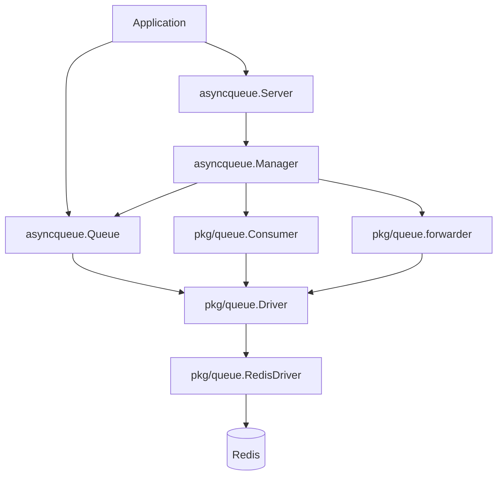
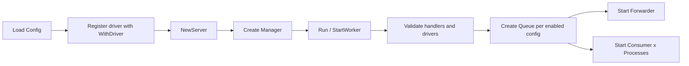
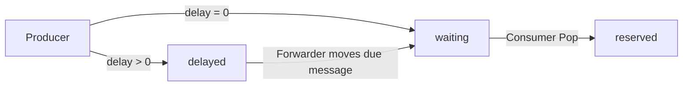
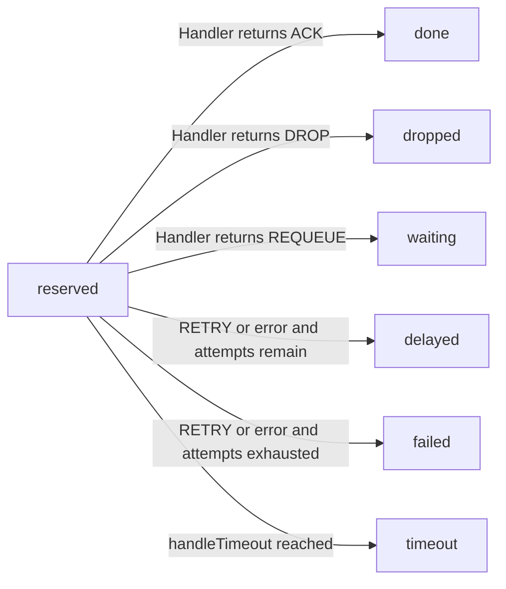
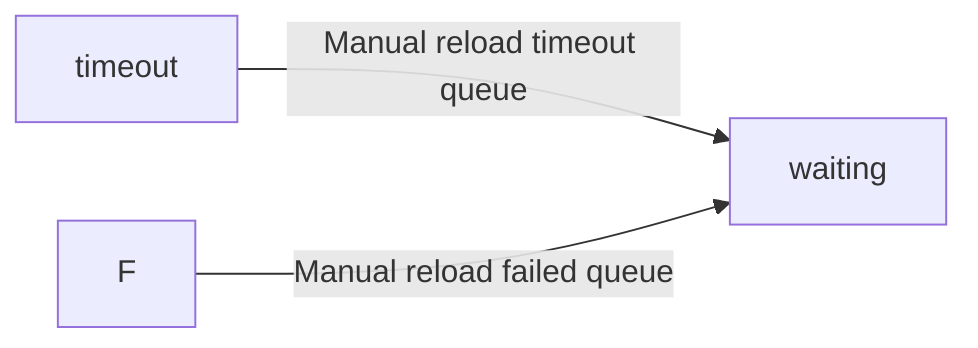

# Detailed Guide

[简体中文](zh-CN/guide.md)

## Overview

`async-queue-go` separates business routing from backend wiring:

- `queue`: business queue key such as `order`
- `driver`: backend registration key such as `redis`
- `channel`: backend storage namespace such as `queue:order`

The current repository ships with a Redis implementation and keeps the runtime behind `pkg/queue.Driver`.

## Start Here (Beginner Path)

If this is your first time using the project, read in this order:

1. `Quick Start in 5 Minutes` (immediate runnable path)
2. `Task and Message Relationship` (what you publish vs what runtime stores)
3. `Queue Management APIs` (how to inspect/reload/cancel messages)
4. `Message Lifecycle` (deeper runtime flow and state transitions)
5. `Architecture` and `Custom Driver Extension` (advanced understanding)

### Reliability Guarantees and Boundaries

- Atomicity:
  queue state transitions are committed through Redis Lua scripts, so multi-key updates in one operation are atomic.
- Timeout fault tolerance:
  when a consumer exits unexpectedly after `reserved`, forwarder migrates expired reservations to `timeout`.
- Reloadability:
  `Reload("timeout")` and `Reload("failed")` are explicit operational paths to put messages back to `waiting`.
- Delivery semantics:
  this project provides at-least-once delivery, not exactly-once.
  You must design handler idempotency to handle possible duplicate deliveries.
- Loss boundary:
  no silent loss is expected in normal flow; loss can still happen under external destructive actions or storage-level data loss.

> [!IMPORTANT]
> Delivery guarantee is **at-least-once**. Business handlers should be **idempotent**.

> [!WARNING]
> Do not interpret this as exactly-once or absolute no-loss across infrastructure failures.
> External destructive operations and storage-level data loss are out of runtime guarantees.

## Quick Start in 5 Minutes

Minimal steps:

1. Start Redis (`127.0.0.1:6379`).
2. Register one driver: `WithDriver("redis", queue.NewRedisDriver(client))`.
3. Define one queue in `Config.Queues` (for example key `order`).
4. Bind handler using the same queue key: `serveMux.Handle("order", handler)`.
5. Run server: `server.Run(ctx, serveMux)`.
6. Publish tasks: `server.Queue("order").PushTask(...)`.

Recommended runnable examples:

- Basic: [`examples/demo/basic/main.go`](/Users/liuxiaozhi/Desktop/async-queue-go/examples/demo/basic/main.go)
- Business scenario: [`examples/demo/order/main.go`](/Users/liuxiaozhi/Desktop/async-queue-go/examples/demo/order/main.go)

## Configuration Example

```json
{
  "queues": {
    "order": {
      "driver": "redis",
      "channel": "queue:order",
      "enabled": true,
      "pop_timeout": 1,
      "handle_timeout": 30,
      "retry_seconds": [5, 10, 30],
      "message_ttl": 86400,
      "max_attempts": 3,
      "processes": 2,
      "concurrent": 20,
      "max_messages": 0,
      "auto_restart": false,
      "shutdown_timeout": 30
    }
  }
}
```

Primary usage (recommended): build `Config` in code and use `NewServer` directly.
Handler binding rule: `ServeMux.Handle(<queue>, <handler>)` must use the same `<queue>` key as `Config.Queues`, otherwise enabled workers fail to start.

> [!IMPORTANT]
> **Required binding**: each enabled queue key in `Config.Queues` must have a matching
> `ServeMux.Handle(<queue>, <handler>)` registration before `Run`.

Complete runnable example:

```go
package main

import (
	"context"
	"encoding/json"
	"errors"
	"fmt"
	"github.com/liuxiaozhicn/async-queue-go/asyncqueue"
	"github.com/liuxiaozhicn/async-queue-go/pkg/core"
	"github.com/liuxiaozhicn/async-queue-go/pkg/queue"
	"github.com/redis/go-redis/v9"
	"log"
	"math/rand"
	"os/signal"
	"sync"
	"syscall"
	"time"
)

const (
	queueName = "order"
)

var ErrUnknownProcessing = errors.New("unknown order processing error")

// OrderTask handles order creation.
type OrderTask struct {
	OrderNo     string  `json:"order_no"`
	UserID      int     `json:"user_id"`
	TotalAmount float64 `json:"total_amount"`
}

// OrderTaskHandler handles order creation.
type OrderTaskHandler struct {
}

func (h *OrderTaskHandler) nextResult() (core.Result, error) {
	switch rand.Intn(5) {
	case 0:
		return core.ACK, nil
	case 1:
		return core.RETRY, nil
	case 2:
		return core.REQUEUE, nil
	case 3:
		return core.DROP, nil
	default:
		return "", ErrUnknownProcessing
	}
}

func (h *OrderTaskHandler) Handle(ctx context.Context, m *core.Message) (core.Result, error) {
	job := &OrderTask{}
	_ = json.Unmarshal(m.Payload, job)

	duration := time.Duration(100+rand.Intn(200)) * time.Millisecond
	select {
	case <-time.After(duration):
		return h.nextResult()
	case <-ctx.Done():
		return core.RETRY, ctx.Err()
	}
}

func generateOrderNo() string {
	b := make([]byte, 4)
	_, _ = rand.Read(b)
	randPart := fmt.Sprintf("%08x", b) // 8位随机hex
	datePart := time.Now().Format("20060102")
	return fmt.Sprintf("bn-%s-%s", datePart, randPart)
}

func main() {
	client := redis.NewClient(&redis.Options{Addr: "127.0.0.1:6379"})
	defer client.Close()

	queueCfg := &asyncqueue.Config{
		Queues: map[string]asyncqueue.QueueConfig{
			queueName: {
				Driver:          "redis",
				Channel:         "queue:order",
				Enabled:         true,
				PopTimeout:      1,
				HandleTimeout:   180,
				ShutdownTimeout: 240,
				Processes:       2,
				Concurrent:      50,
				MaxAttempts:     3,
				RetrySeconds:    []int{5, 10, 30},
				AutoRestart:     false,
				MaxMessages:     10,
			},
		},
	}

	ctx, stop := signal.NotifyContext(context.Background(), syscall.SIGINT, syscall.SIGTERM)
	defer stop()

	s, err := asyncqueue.NewServer(queueCfg, asyncqueue.WithDriver("redis", queue.NewRedisDriver(client)))
	if err != nil {
		log.Fatalf("[Main] failed to load server: %v", err)
	}

	var wg sync.WaitGroup

	// Start worker
	wg.Add(1)
	go func() {
		defer wg.Done()
		serveMux := asyncqueue.NewServeMux()
		orderJobHandler := &OrderTaskHandler{}
		serveMux.Handle(queueName, orderJobHandler)
		if err := s.Run(ctx, serveMux); err != nil {
			log.Fatalf("server run failed: %v", err)
		}
	}()

	// Push initial sample jobs after worker is ready
	time.Sleep(1 * time.Second)

	// Push periodic jobs every 10s
	wg.Add(1)
	go func() {
		defer wg.Done()
		ticker := time.NewTicker(5 * time.Second)
		defer ticker.Stop()
		queue, _ := s.Queue(queueName)
		for {
			select {
			case <-ctx.Done():
				return
			case <-ticker.C:
				orderNo := generateOrderNo()
				job := &OrderTask{
					OrderNo:     orderNo,
					UserID:      rand.Intn(1000) + 1,
					TotalAmount: float64(rand.Intn(95000)+1000) / 100.0,
				}
				_, err := queue.PushTask(ctx, job, 30)
				if err != nil {
					continue
				}
			}
		}
	}()
	wg.Wait()
}

```

If an enabled queue type is not bound in `ServeMux`, worker startup fails.
You can use this `messageID` later for management operations such as `GetMessage`, `Cancel`, or `RetryByID`.


Use file-loading only when you intentionally manage queue settings from external files.

## Task and Message Relationship

- `Task` is an application-level payload struct.
- `Message` is the persisted runtime envelope used by queue internals.
- `PushTask` converts `Task` into `Message.Payload` (JSON) and writes it to backend.
- `PushMessage` publishes a caller-constructed envelope directly.
- Consumer handlers always receive `*core.Message`; decode `m.Payload` into your business `Task` type.
- `messageID` is generated by the driver at publish time and is the stable key for queue management APIs.

## Configuration Reference

### Complete Example

```json
{
  "queues": {
    "order": {
      "driver": "redis",
      "channel": "queue:order",
      "enabled": true,
      "pop_timeout": 3,
      "handle_timeout": 180,
      "retry_seconds": [10, 30, 60, 120, 300],
      "message_ttl": 864000,
      "max_attempts": 5,
      "processes": 2,
      "concurrent": 50,
      "max_messages": 0,
      "auto_restart": false,
      "shutdown_timeout": 240
    }
  }
}
```

### Parameter Details

| Field | Default | Meaning | Recommended range / notes |
| --- | --- | --- | --- |
| `driver` | `redis` (auto-filled on file load) | Driver key resolved from `WithDriver(name, driver)` | Keep `redis` unless you register a custom driver |
| `channel` | none (required) | Physical queue namespace in backend | Use stable, business-scoped names, e.g. `queue:order` |
| `enabled` | `false` | Whether this queue starts workers/forwarder | `true` for active queues |
| `pop_timeout` | `1` (config load fallback) | Empty poll wait in seconds | `1~5`, higher reduces empty-poll pressure |
| `handle_timeout` | `10` (config load fallback) | Single message processing timeout in seconds | Usually `60~300`, set from handler p99 latency |
| `retry_seconds` | `[5]` (config load fallback) | Retry backoff schedule in seconds | Increasing sequence, e.g. `[10,30,60,120,300]` |
| `message_ttl` | `864000` | TTL for `message:<id>` entity in seconds | `1~30` days based on audit/debug needs; `0` means no expiration |
| `max_attempts` | `3` | Maximum delivery attempts | Usually `3~8`; tune with business idempotency and SLA |
| `processes` | `1` | Number of consumer processes in this runtime | Start with CPU core count or lower, then scale by throughput |
| `concurrent` | `10` | Goroutine concurrency per process | Tune by downstream capacity (DB/RPC), avoid overload |
| `max_messages` | `0` | Messages processed before worker exits (`0` unlimited) | Keep `0` for long-running workers |
| `auto_restart` | `false` | Restart worker after `max_messages` reached | Enable only when intentionally using bounded workers |
| `shutdown_timeout` | `30` | Graceful shutdown wait in seconds | Usually `60~300` for production |

### Quick Tuning Guide

| Symptom | Tune first |
| --- | --- |
| Messages frequently move to `timeout` | Increase `handle_timeout` |
| Retry storms under failures | Increase `retry_seconds` backoff and/or reduce `max_attempts` |
| High Redis CPU on idle queues | Increase `pop_timeout` |
| Downstream DB/RPC saturation | Reduce `concurrent` or `processes` |
| Slow shutdown on deploy/restart | Increase `shutdown_timeout` |

## Architecture

### Layered View



### Startup Flow



### Runtime Responsibilities

| Component | Responsibility |
| --- | --- |
| `Server` | High-level entry point for config, driver registration, handlers, and lifecycle |
| `Manager` | Creates queues, consumers, and forwarders from config and manages startup/shutdown |
| `Queue` | Producer-facing API for publish, query, delete, retry, reload, and stats |
| `Consumer` | Consumption loop that calls handlers and commits ACK / RETRY / REQUEUE / DROP |
| `Forwarder` | Background mover for delayed jobs and expired reservations |
| `Driver` | Backend abstraction for queue operations and state transitions |
| `RedisDriver` | Built-in backend implementation |

## Message Lifecycle

Delivery result branch:



Consumer result paths:



Failure or timeout recovery branch:



Notes:

- `waiting` is the main consumable queue
- `reserved` means a consumer has claimed the message but not committed the result yet
- `delayed` is used for both explicit delay and retry backoff
- `timeout` and `failed` do not go back to `waiting` automatically
- manual reload is an explicit operation, so it is shown separately from the main processing path

### State Transition Matrix

| Stage | Trigger | Queue transition | Persisted status |
| --- | --- | --- | --- |
| Producer | `Push(delay=0)` | `-> waiting` | `waiting` |
| Producer | `Push(delay>0)` | `-> delayed` | `delayed` |
| Forwarder | delayed due | `delayed -> waiting` | `waiting` |
| Consumer acquire | `Pop` | `waiting -> reserved` | `reserved` |
| Consumer commit | `ACK` | `reserved -> (removed)` | `done` |
| Consumer commit | `DROP` | `reserved -> (removed)` | `dropped` |
| Consumer commit | `REQUEUE` | `reserved -> waiting` | `waiting` |
| Consumer commit | `RETRY` with `delay>0` | `reserved -> delayed` | `delayed` |
| Consumer commit | `RETRY` with `delay<=0` | `reserved -> waiting` | `waiting` |
| Consumer error | error and attempts remain, `delay>0` | `reserved -> delayed` | `delayed` |
| Consumer error | error and attempts remain, `delay<=0` | `reserved -> waiting` | `waiting` |
| Consumer terminal | error/RETRY and attempts exhausted | `reserved -> failed` | `failed` |
| Forwarder | reservation expired | `reserved -> timeout` | `timeout` |
| Manual operation | `Reload("timeout")` | `timeout -> waiting` | `waiting` |
| Manual operation | `Reload("failed")` | `failed -> waiting` | `waiting` |
| Manual operation | `Cancel` (only in `delayed`) | `delayed -> (removed)` | `canceled` |

### Concurrency & Consistency Rules

| Rule | Why |
| --- | --- |
| Queue position is the source of truth for dispatch state | `waiting/reserved/delayed` directly determine whether a message can be consumed, retried, or canceled |
| Message `status` is a persisted view, not the only decision source | In high-throughput scenarios, decision logic should rely on queue operations in Lua first, then update status |
| One commit action per consumed message | After a message is popped into `reserved`, only one of `ACK/RETRY/REQUEUE/DROP/FAIL` should succeed semantically |
| Retry path is `reserved -> waiting/delayed` | `delay<=0` means immediate next scheduling round (`waiting`), `delay>0` means backoff (`delayed`) |
| Cancel is allowed only in `delayed` | Once a message reaches `waiting` or `reserved`, cancellation is rejected by design |

### Lua Atomicity, Timeout Fault Tolerance, and Message Loss Semantics

- Lua atomicity:
  all queue-state commits (`pop`, `ack`, `retry`, `requeue`, `fail`, `drop`, `cancel`) are executed via single Redis Lua scripts.
  Each script runs atomically, so key updates inside one transition are all-or-nothing.
- Timeout fault tolerance:
  if a consumer crashes, hangs, or loses process ownership after `reserved`, forwarder moves expired reservations to `timeout`.
  Operators can later `Reload("timeout")` to re-deliver those messages.
- Message loss semantics:
  the system targets at-least-once delivery, not exactly-once.
  Under normal Redis durability and key TTL settings, messages are not silently dropped from the active flow.
  However, data can still be lost in external conditions (for example Redis data loss, explicit `Flush`, key expiration by TTL, or manual destructive operations).

### Troubleshooting Checklist

| Symptom | First checks |
| --- | --- |
| Message stuck in `reserved` | Check handler timeout and whether commit actions (`ACK/RETRY/...`) are returning errors |
| Message unexpectedly in `timeout` | Check `handleTimeout` against real handler p99 latency |
| Retry did not delay | Verify retry delay value; `delay<=0` intentionally goes to `waiting` |
| Cancel returns false | Confirm message is still in `delayed` (not `waiting`/`reserved`) |
| Status looks stale | Verify queue membership first, then inspect `message:<id>` payload |

## Handler Result Semantics

| Result | Meaning |
| --- | --- |
| `core.ACK` | Success; remove the message from the reserved queue |
| `core.RETRY` | Send the message to the delayed queue with retry policy |
| `core.REQUEUE` | Move the message back to the waiting queue immediately |
| `core.DROP` | Mark the message as `dropped` and stop retrying |

If the handler returns `error`, the framework follows the error path instead of the explicit `Result`.

`DROP` is a business-level discard decision, not a physical delete. The message leaves the active processing queues, but its entity can still remain until TTL expires.

## Redis Storage Model

The Redis driver generates a key set per `channel`:

```text
{queue:order}:waiting
{queue:order}:reserved
{queue:order}:delayed
{queue:order}:timeout
{queue:order}:failed
{queue:order}:message:<id>
{queue:order}:msg_seq
{queue:order}:msg_seq_epoch
```

Meaning:

- `waiting`: ready-to-consume queue
- `reserved`: claimed but not committed
- `delayed`: delayed and retry messages
- `timeout`: expired reservations
- `failed`: messages that exhausted retries
- `message:<id>`: message entity payload

The `{...}` hash tag keeps keys for one business queue in the same Redis Cluster slot.

## Queue Management APIs

| Method                                | Purpose |
|---------------------------------------| --- |
| `PushTask(ctx, job, delaySeconds)`     | Publish a structured task |
| `PushMessage(ctx, msg, delaySeconds)` | Publish a raw message |
| `Info(ctx)`                           | Read waiting / reserved / delayed / timeout / failed counts |
| `GetMessage(ctx, id)`                 | Fetch message details |
| `Cancel(ctx, id)`                     | Cancel a delayed message before it enters dispatch, and mark it as `canceled` |
| `RetryByID(ctx, id, delaySeconds)`    | Retry a message with a new delay |
| `Reload(ctx, "timeout" or "failed")`  | Move timeout or failed messages back to waiting |
| `Flush(ctx, queueName)`               | Clear one internal queue |

## Low-Level Consumer

If you do not want `Server` / `Manager`, you can compose the runtime yourself:

- `queue.NewRedisDriver(...)`
- `queue.NewConsumer(...)`
- `worker.NewWorker(...)`

Default `NewConsumer(...)` options (when not overridden):

| Option | Default |
| --- | --- |
| `concurrentLimit` | `10` |
| `popTimeout` | `3s` |
| `handleTimeout` | `180s` |
| `retrySeconds` | `[10,30,60,120,300]` |
| `messageTTL` | `864000` (10 days) |

Reference:

- [`../examples/worker/main.go`](../examples/worker/main.go)

## Custom Driver Extension

Implement:

```go
type Driver interface {
    Ping(ctx context.Context) error
    Push(ctx context.Context, channel string, m *core.Message, delaySeconds int, messageTTL int) error
    Get(ctx context.Context, channel string, id string) (*core.Message, error)
    Cancel(ctx context.Context, channel string, id string) (bool, error)
    Pop(ctx context.Context, channel string, popTimeout time.Duration, handleTimeout time.Duration) (string, *core.Message, error)
    Ack(ctx context.Context, channel string, messageID string) error
    Fail(ctx context.Context, channel string, messageID string) error
    Drop(ctx context.Context, channel string, messageID string) error
    Requeue(ctx context.Context, channel string, messageID string) error
    Retry(ctx context.Context, channel string, id string, delaySeconds int) (bool, error)
    Reload(ctx context.Context, channel string, queue string) (int, error)
    Flush(ctx context.Context, channel string, queue string) error
    Info(ctx context.Context, channel string) (Info, error)
    ForwardMessages(ctx context.Context, channel string) (int64, int64, error)
}
```

Registration:

```go
server, err := asyncqueue.NewServer(
    cfg,
    asyncqueue.WithDriver("custom", customDriver),
)
```

## FAQ

### Why is `driver` in config not the queue name?

Because `driver` identifies the backend implementation, not the business queue.

### Why can one `RedisDriver` serve multiple queues?

Because the current `Driver` interface receives `channel` on every operation, so the driver does not bind to a single queue at construction time.

### Why not expose `Server.Push` directly?

Publishing already belongs to `Queue`, while `Server` is the runtime entry point and queue lookup layer.

Recommended usage:

```go
queueInstance, err := server.Queue("order")
id, err := queueInstance.PushTask(ctx, job, 0)
```

### What does `DROP` mean?

- `DROP` is a consumer result. It means the business logic has decided not to continue processing the message, and the message status becomes `dropped`.
### How does `Cancel` behave?
- `Cancel` is for giving up dispatch while the message is still in `delayed`.
- If the message is already in `waiting`, it has become dispatch-ready and cancellation is rejected with `ErrMessageAlreadyReadyForDispatch`.
- If the message is already in `reserved`, it has been claimed by a consumer and cancellation is rejected with `ErrMessageAlreadyInExecution`.
