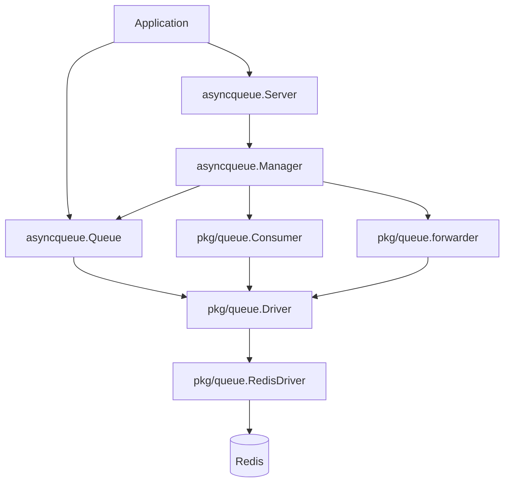
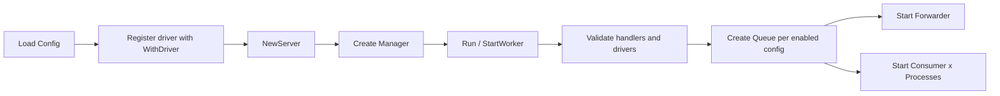
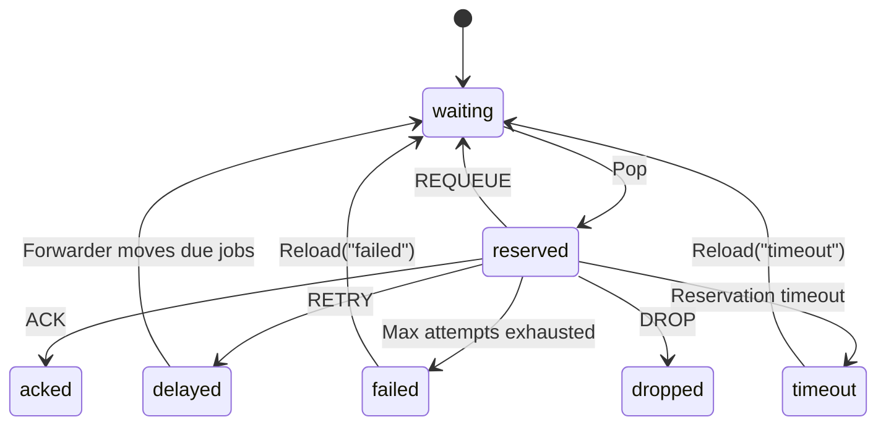

# Detailed Guide

[简体中文](zh-CN/guide.md)

## Overview

`async-queue-go` separates business routing from backend wiring:

- `queue name`: business queue key such as `order`
- `driver name`: backend registration key such as `redis`
- `channel`: backend storage namespace such as `queue:order`

The current repository ships with a Redis implementation and keeps the runtime behind `pkg/queue.Driver`.

## Configuration Example

```json
{
  "queues": {
    "order": {
      "driver": "redis",
      "channel": "queue:order",
      "enabled": true,
      "pop_timeout": 1,
      "handle_timeout": 30,
      "retry_seconds": [5, 10, 30],
      "message_ttl": 86400,
      "max_attempts": 3,
      "processes": 2,
      "concurrent": 20,
      "max_messages": 0,
      "auto_restart": false,
      "shutdown_timeout": 30
    }
  }
}
```

Load from file:

```go
server, err := asyncqueue.LoadServer(
    "config.json",
    asyncqueue.WithDriver("redis", queue.NewRedisDriver(redisClient)),
)
```

If you build `Config` directly in Go code, set `Driver` and runtime fields explicitly instead of relying on file-loading defaults.

## Architecture

### Layered View



### Startup Flow



### Runtime Responsibilities

| Component | Responsibility |
| --- | --- |
| `Server` | High-level entry point for config, driver registration, handlers, and lifecycle |
| `Manager` | Creates queues, consumers, and forwarders from config and manages startup/shutdown |
| `Queue` | Producer-facing API for publish, query, delete, retry, reload, and stats |
| `Consumer` | Consumption loop that calls handlers and commits ACK / RETRY / REQUEUE / DROP |
| `Forwarder` | Background mover for delayed jobs and expired reservations |
| `Driver` | Backend abstraction for queue operations and state transitions |
| `RedisDriver` | Built-in backend implementation |

## Message Lifecycle



Detailed flow:

```mermaid
flowchart TD
    P[Producer PushJob / PushMessage] --> Q{Delayed publish?}
    Q -- No --> W[waiting]
    Q -- Yes --> D[delayed]

    D -->|Delay expires and forwarder moves message| W
    W -->|Consumer Pop| R[reserved]

    R -->|Handler returns ACK| ACK[done]
    R -->|Handler returns DROP| DROP[dropped]
    R -->|Handler returns REQUEUE| W
    R -->|Handler returns RETRY and attempts remain| D
    R -->|Handler returns RETRY and attempts exhausted| F[failed]
    R -->|Handler returns error or panic and attempts remain| D
    R -->|Handler returns error or panic and attempts exhausted| F
    R -->|handleTimeout reached and forwarder detects expired reservation| T[timeout]

    T -->|Manual Reload('timeout')| W
    F -->|Manual Reload('failed')| W
```

Notes:

- `waiting` is the main consumable queue
- `reserved` means a consumer has claimed the message but not committed the result yet
- `delayed` is used for both explicit delay and retry backoff
- `timeout` does not go back to `waiting` automatically
- `failed` is intended for inspection, compensation, or replay

## Handler Result Semantics

| Result | Meaning |
| --- | --- |
| `core.ACK` | Success; remove the message from the reserved queue |
| `core.RETRY` | Send the message to the delayed queue with retry policy |
| `core.REQUEUE` | Move the message back to the waiting queue immediately |
| `core.DROP` | Drop the message without retry |

If the handler returns `error`, the framework follows the error path instead of the explicit `Result`.

## Redis Storage Model

The Redis driver generates a key set per `channel`:

```text
{queue:order}:waiting
{queue:order}:reserved
{queue:order}:delayed
{queue:order}:timeout
{queue:order}:failed
{queue:order}:message:<id>
{queue:order}:msg_seq
{queue:order}:msg_seq_epoch
```

Meaning:

- `waiting`: ready-to-consume queue
- `reserved`: claimed but not committed
- `delayed`: delayed and retry messages
- `timeout`: expired reservations
- `failed`: messages that exhausted retries
- `message:<id>`: message entity payload

The `{...}` hash tag keeps keys for one business queue in the same Redis Cluster slot.

## Configuration Reference

| Field | Default | Meaning |
| --- | --- | --- |
| `driver` | `redis` (only auto-filled when loading from file) | Driver name used to look up `WithDriver(name, driver)` registrations |
| `channel` | none | Backend storage channel; must match the producer side |
| `enabled` | `false` | Whether the queue is enabled |
| `pop_timeout` | `1` | Empty-poll timeout in seconds |
| `handle_timeout` | `10` | Per-message handling timeout in seconds |
| `retry_seconds` | `[5]` | Retry backoff sequence |
| `message_ttl` | `864000` | Message entity TTL in seconds |
| `max_attempts` | `3` | Maximum delivery attempts |
| `processes` | `1` | Number of consumer instances started in-process |
| `concurrent` | `10` | Concurrency per consumer instance |
| `max_messages` | `0` | Max messages processed by one consumer; `0` means unlimited |
| `auto_restart` | `false` | Whether to restart a worker after hitting `max_messages` |
| `shutdown_timeout` | `30` | Graceful shutdown timeout in seconds |

## Queue Management APIs

| Method | Purpose |
| --- | --- |
| `PushJob(ctx, job, delaySeconds)` | Publish a structured job |
| `PushMessage(ctx, msg, delaySeconds)` | Publish a raw message |
| `Info(ctx)` | Read waiting / reserved / delayed / timeout / failed counts |
| `GetMessage(ctx, id)` | Fetch message details |
| `DeleteMessage(ctx, msg)` | Delete by message entity |
| `DeleteByID(ctx, id)` | Delete by message id |
| `RetryByID(ctx, id, delaySeconds)` | Retry a message with a new delay |
| `Reload(ctx, "timeout"|"failed")` | Move timeout or failed messages back to waiting |
| `Flush(ctx, queueName)` | Clear one internal queue |

## Low-Level Consumer

If you do not want `Server` / `Manager`, you can compose the runtime yourself:

- `queue.NewRedisDriver(...)`
- `queue.NewConsumer(...)`
- `worker.NewWorker(...)`

Reference:

- [`../examples/worker/main.go`](../examples/worker/main.go)

## Custom Driver Extension

Implement:

```go
type Driver interface {
    Ping(ctx context.Context) error
    Push(ctx context.Context, channel string, m *core.Message, delaySeconds int, messageTTL int) error
    Delete(ctx context.Context, channel string, m *core.Message) error
    Pop(ctx context.Context, channel string, popTimeout time.Duration, handleTimeout time.Duration) (string, *core.Message, error)
    Remove(ctx context.Context, channel string, messageID string) error
    Ack(ctx context.Context, channel string, messageID string) error
    Fail(ctx context.Context, channel string, messageID string) error
    Requeue(ctx context.Context, channel string, messageID string) error
    Retry(ctx context.Context, channel string, m *core.Message, retrySeconds []int) error
    Reload(ctx context.Context, channel string, queue string) (int, error)
    Flush(ctx context.Context, channel string, queue string) error
    Info(ctx context.Context, channel string) (Info, error)
}
```

Optional capabilities:

- `MessageReader`
- `MessageWriter`
- `MessageForwarder`

Registration:

```go
server, err := asyncqueue.NewServer(
    cfg,
    asyncqueue.WithDriver("custom", customDriver),
)
```

## FAQ

### Why is `driver` in config not the queue name?

Because `driver` identifies the backend implementation, not the business queue.

### Why can one `RedisDriver` serve multiple queues?

Because the current `Driver` interface receives `channel` on every operation, so the driver does not bind to a single queue at construction time.

### Why not expose `Server.Push` directly?

Publishing already belongs to `Queue`, while `Server` is the runtime entry point and queue lookup layer.

Recommended usage:

```go
queueInstance, err := server.Queue("order")
id, err := queueInstance.PushJob(ctx, job, 0)
```
