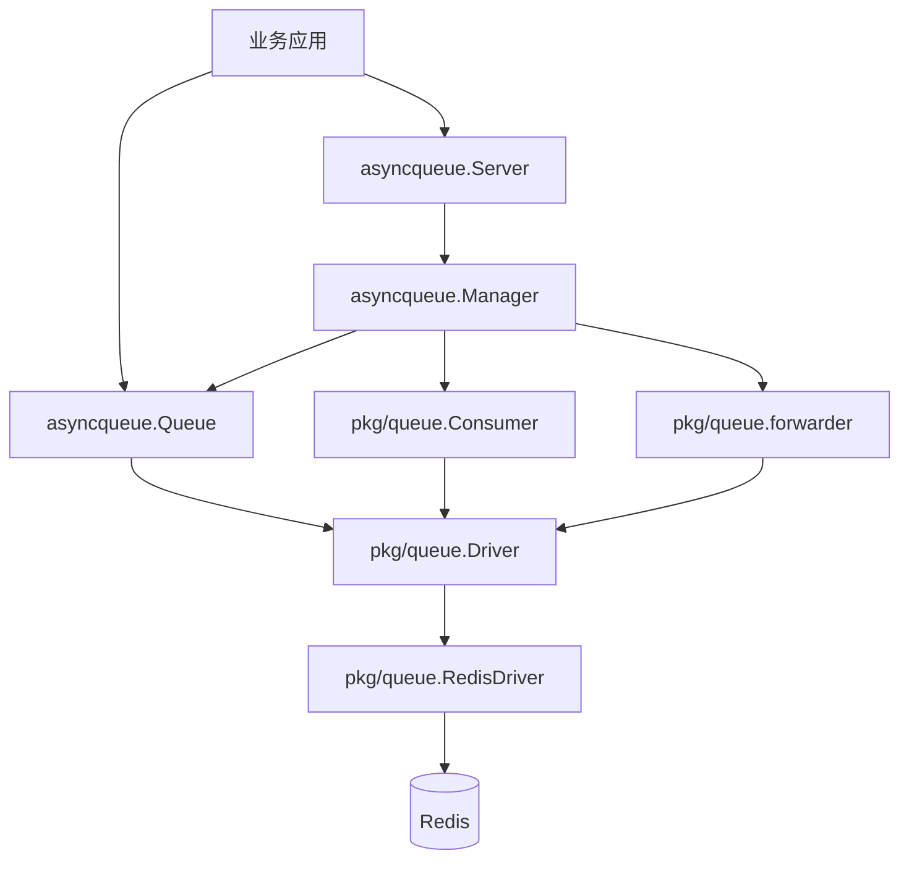
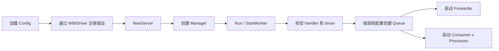
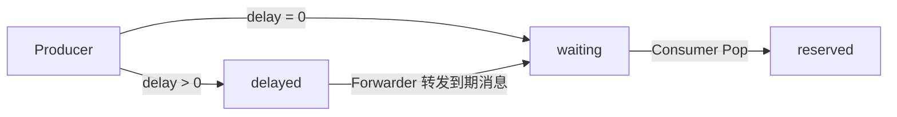
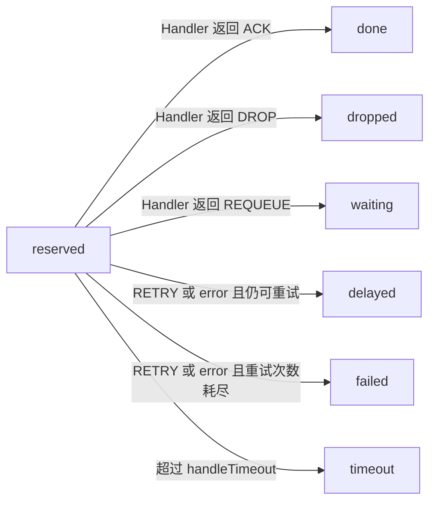
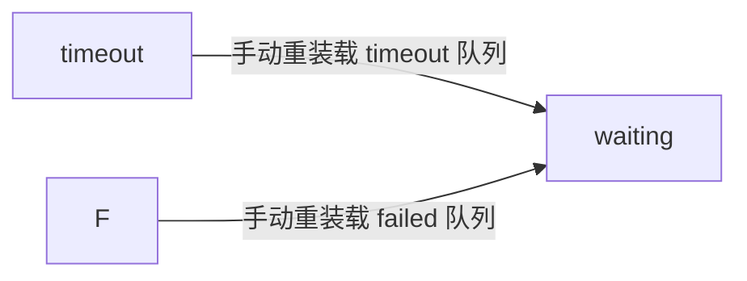

# 详细文档

[English](../guide.md)

## 概览

`async-queue-go` 把业务路由和后端驱动做了分层：

- `queue name`：业务队列名，例如 `order`
- `driver name`：后端驱动注册名，例如 `redis`
- `channel`：后端存储命名空间，例如 `queue:order`

当前仓库内置 Redis 实现，运行时统一抽象在 `pkg/queue.Driver` 之下。

## 配置示例

```json
{
  "queues": {
    "order": {
      "driver": "redis",
      "channel": "queue:order",
      "enabled": true,
      "pop_timeout": 1,
      "handle_timeout": 30,
      "retry_seconds": [5, 10, 30],
      "message_ttl": 86400,
      "max_attempts": 3,
      "processes": 2,
      "concurrent": 20,
      "max_messages": 0,
      "auto_restart": false,
      "shutdown_timeout": 30
    }
  }
}
```

从配置文件加载：

```go
server, err := asyncqueue.LoadServer(
    "config.json",
    asyncqueue.WithDriver("redis", queue.NewRedisDriver(redisClient)),
)
```

如果你是在 Go 代码里直接手写 `Config`，请显式填写 `Driver` 和各项运行参数，不要依赖文件加载时的默认值补齐。

## 架构说明

### 分层结构



### 启动流程



### 运行职责

| 组件 | 职责 |
| --- | --- |
| `Server` | 高层入口，负责配置、驱动注册、handler 注册和生命周期 |
| `Manager` | 根据配置创建队列、消费者、forwarder，并管理启停 |
| `Queue` | 生产侧 API，负责投递、查询、删除、重试、重装载和统计 |
| `Consumer` | 消费循环，调用 handler 并提交 ACK / RETRY / REQUEUE / DROP |
| `Forwarder` | 后台搬运延迟到期消息和超时保留消息 |
| `Driver` | 后端抽象层，定义队列操作和状态流转能力 |
| `RedisDriver` | 当前内置后端实现 |

## 消息生命周期



消费结果分支：



人工恢复分支：



说明：

- `waiting` 是主消费入口
- `reserved` 表示消息已被某个 consumer 取走，但还没有提交结果
- `delayed` 同时承载主动延迟和重试退避
- `timeout` 和 `failed` 都不会自动回到 `waiting`
- 手动重装载是显式操作，所以单独拆成一张恢复图

## Handler 返回值语义

| 返回值 | 含义 |
| --- | --- |
| `core.ACK` | 成功完成，从保留队列移除 |
| `core.RETRY` | 按重试策略进入延迟队列 |
| `core.REQUEUE` | 立即回到等待队列 |
| `core.DROP` | 直接丢弃，不再重试 |

如果 handler 返回 `error`，框架会走错误处理路径，而不是使用显式返回的 `Result`。

## Redis 存储模型

Redis 驱动会按 `channel` 生成一组 key：

```text
{queue:order}:waiting
{queue:order}:reserved
{queue:order}:delayed
{queue:order}:timeout
{queue:order}:failed
{queue:order}:message:<id>
{queue:order}:msg_seq
{queue:order}:msg_seq_epoch
```

说明：

- `waiting`：等待消费的消息队列
- `reserved`：已弹出但尚未提交结果的消息
- `delayed`：延迟消息和重试消息
- `timeout`：处理超时后的消息
- `failed`：重试耗尽的消息
- `message:<id>`：消息实体

`{...}` 哈希标签用于保证同一业务队列的 key 落在同一个 Redis Cluster slot。

## 配置项说明

| 字段 | 默认值 | 说明 |
| --- | --- | --- |
| `driver` | `redis`（仅配置文件加载时自动补） | 用于从 `WithDriver(name, driver)` 注册表中取驱动 |
| `channel` | 无 | 后端存储通道，必须和生产端一致 |
| `enabled` | `false` | 是否启用该队列 |
| `pop_timeout` | `1` | 空轮询等待秒数 |
| `handle_timeout` | `10` | 单条消息处理超时秒数 |
| `retry_seconds` | `[5]` | 重试退避序列 |
| `message_ttl` | `864000` | 消息实体 TTL，单位秒 |
| `max_attempts` | `3` | 最大尝试次数 |
| `processes` | `1` | 进程内启动的消费者实例数 |
| `concurrent` | `10` | 每个消费者实例的并发度 |
| `max_messages` | `0` | 单个消费者处理上限；`0` 表示不限制 |
| `auto_restart` | `false` | 达到 `max_messages` 后是否重启 worker |
| `shutdown_timeout` | `30` | 优雅停机等待秒数 |

## 队列管理能力

| 方法 | 说明 |
| --- | --- |
| `PushJob(ctx, job, delaySeconds)` | 投递结构化任务 |
| `PushMessage(ctx, msg, delaySeconds)` | 投递原始消息 |
| `Info(ctx)` | 获取 waiting / reserved / delayed / timeout / failed 统计 |
| `GetMessage(ctx, id)` | 获取消息详情 |
| `DeleteMessage(ctx, msg)` | 按消息实体删除 |
| `DeleteByID(ctx, id)` | 按 message id 删除 |
| `RetryByID(ctx, id, delaySeconds)` | 重新设定延迟后重试 |
| `Reload(ctx, "timeout"|"failed")` | 把 timeout 或 failed 消息重新放回 waiting |
| `Flush(ctx, queueName)` | 清空一个内部队列 |

## 低层 Consumer 用法

如果你不想使用 `Server` / `Manager`，可以自己组合运行时：

- `queue.NewRedisDriver(...)`
- `queue.NewConsumer(...)`
- `worker.NewWorker(...)`

参考：

- [`../../examples/worker/main.go`](../../examples/worker/main.go)

## 自定义驱动扩展

你需要实现：

```go
type Driver interface {
    Ping(ctx context.Context) error
    Push(ctx context.Context, channel string, m *core.Message, delaySeconds int, messageTTL int) error
    Delete(ctx context.Context, channel string, m *core.Message) error
    Pop(ctx context.Context, channel string, popTimeout time.Duration, handleTimeout time.Duration) (string, *core.Message, error)
    Remove(ctx context.Context, channel string, messageID string) error
    Ack(ctx context.Context, channel string, messageID string) error
    Fail(ctx context.Context, channel string, messageID string) error
    Requeue(ctx context.Context, channel string, messageID string) error
    Retry(ctx context.Context, channel string, m *core.Message, retrySeconds []int) error
    Reload(ctx context.Context, channel string, queue string) (int, error)
    Flush(ctx context.Context, channel string, queue string) error
    Info(ctx context.Context, channel string) (Info, error)
}
```

可选能力：

- `MessageReader`
- `MessageWriter`
- `MessageForwarder`

注册方式：

```go
server, err := asyncqueue.NewServer(
    cfg,
    asyncqueue.WithDriver("custom", customDriver),
)
```

## FAQ

### 为什么配置里的 `driver` 不是队列名？

因为 `driver` 表示后端实现注册名，不是业务队列名。

### 为什么同一个 `RedisDriver` 可以服务多个队列？

因为当前 `Driver` 接口每次调用都会显式传入 `channel`，driver 自身不再在构造期绑定单个业务队列。

### 为什么不直接提供 `Server.Push`？

因为投递本身就是 `Queue` 的职责，`Server` 更适合作为运行时入口和队列实例获取入口。

推荐写法：

```go
queueInstance, err := server.Queue("order")
id, err := queueInstance.PushJob(ctx, job, 0)
```
