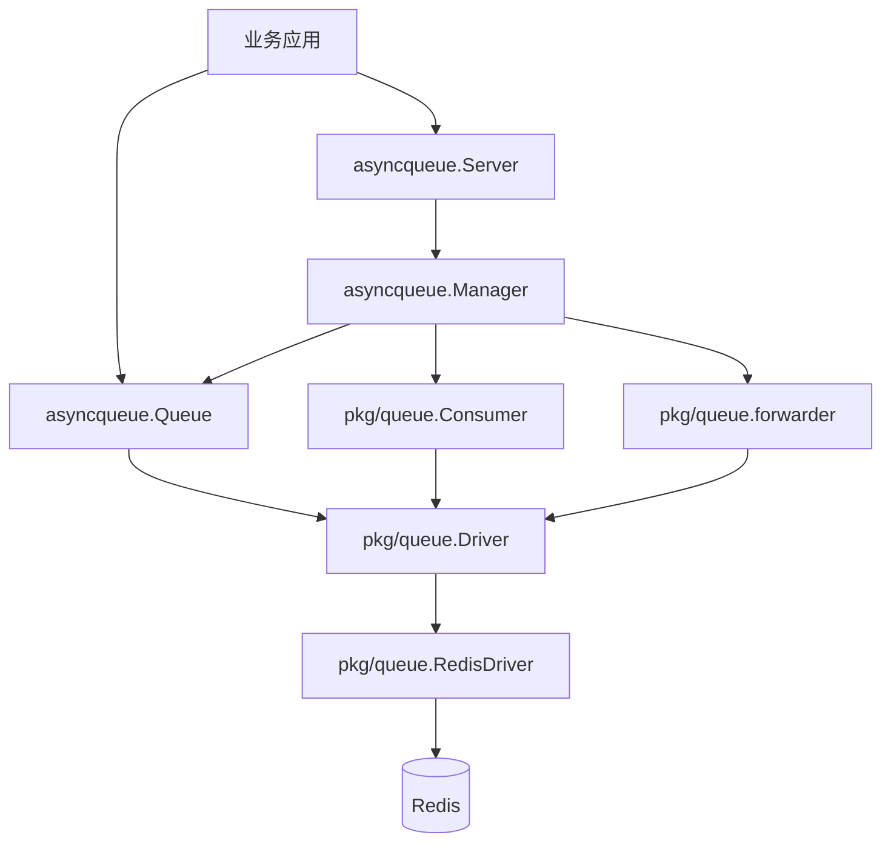
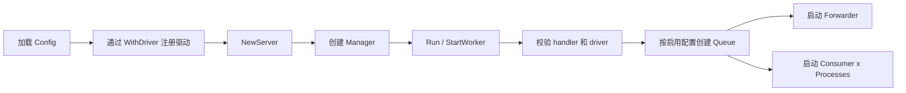
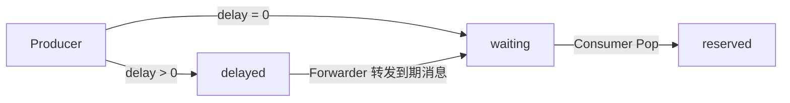
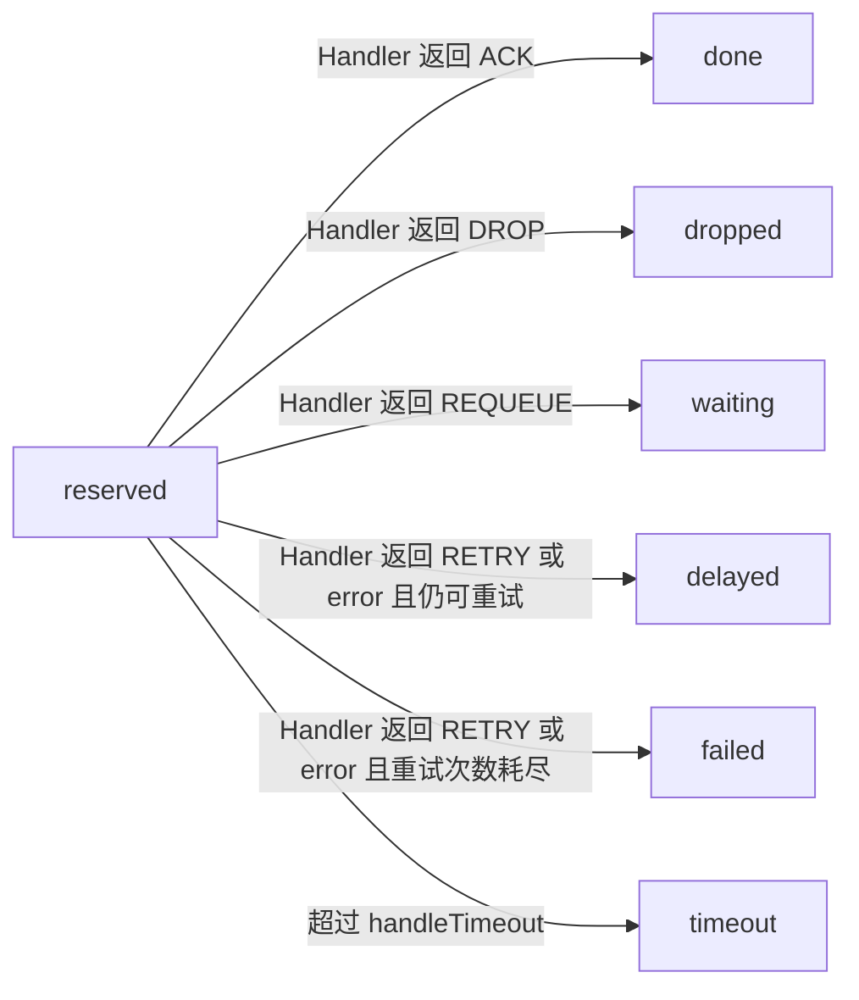
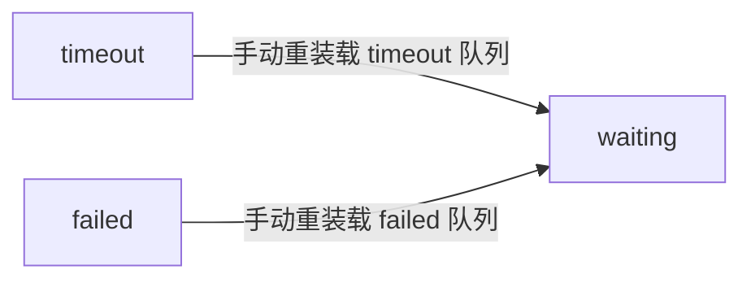

# 详细文档

[English](../guide.md)

## 概览

`async-queue-go` 把业务路由和后端驱动做了分层：

- `queue name`：业务队列名，例如 `order`
- `driver name`：后端驱动注册名，例如 `redis`
- `channel`：后端存储命名空间，例如 `queue:order`

当前仓库内置 Redis 实现，运行时统一抽象在 `pkg/queue.Driver` 之下。

## 配置示例

```json
{
  "queues": {
    "order": {
      "driver": "redis",
      "channel": "queue:order",
      "enabled": true,
      "pop_timeout": 1,
      "handle_timeout": 30,
      "retry_seconds": [5, 10, 30],
      "message_ttl": 86400,
      "max_attempts": 3,
      "processes": 2,
      "concurrent": 20,
      "max_messages": 0,
      "auto_restart": false,
      "shutdown_timeout": 30
    }
  }
}
```

常规用法（推荐）：在代码里构建 `Config`，直接用 `NewServer`。

```go
cfg := &asyncqueue.Config{
    Queues: map[string]asyncqueue.QueueConfig{
        "order": {
            Driver:        "redis",
            Channel:       "queue:order",
            Enabled:       true,
            PopTimeout:    3,
            HandleTimeout: 180,
            RetrySeconds:  []int{10, 30, 60, 120, 300},
            MessageTTL:    864000,
            MaxAttempts:   5,
            Processes:     2,
            Concurrent:    50,
        },
    },
}

server, err := asyncqueue.NewServer(
    cfg,
    asyncqueue.WithDriver("redis", queue.NewRedisDriver(redisClient)),
)
```

`Run` 前必须完成 handler 绑定：

```go
serveMux := asyncqueue.NewServeMux()
orderJobHandler := NewOrderJobHandler()
serveMux.Handle((&OrderJob{}).GetType(), orderJobHandler)

if err := server.Run(ctx, serveMux); err != nil {
    return err
}
```

如果启用队列对应的任务类型没有在 `ServeMux` 绑定，worker 启动会失败。

## 配置项说明

### 完整示例

```json
{
  "queues": {
    "order": {
      "driver": "redis",
      "channel": "queue:order",
      "enabled": true,
      "pop_timeout": 3,
      "handle_timeout": 180,
      "retry_seconds": [10, 30, 60, 120, 300],
      "message_ttl": 864000,
      "max_attempts": 5,
      "processes": 2,
      "concurrent": 50,
      "max_messages": 0,
      "auto_restart": false,
      "shutdown_timeout": 240
    }
  }
}
```

### 参数明细

| 字段 | 默认值 | 说明 | 推荐范围 / 建议 |
| --- | --- | --- | --- |
| `driver` | `redis`（配置文件加载时自动补） | 通过 `WithDriver(name, driver)` 查找驱动注册名 | 除非有自定义驱动，否则保持 `redis` |
| `channel` | 无（必填） | 后端存储命名空间 | 使用稳定业务名，如 `queue:order` |
| `enabled` | `false` | 是否启用该队列的消费与转发 | 生产队列一般设为 `true` |
| `pop_timeout` | `1`（配置加载回退） | 空轮询等待秒数 | `1~5`，越大空轮询压力越低 |
| `handle_timeout` | `10`（配置加载回退） | 单条消息处理超时秒数 | 常用 `60~300`，按 handler 的 p99 耗时设定 |
| `retry_seconds` | `[5]`（配置加载回退） | 重试退避序列（秒） | 建议递增，如 `[10,30,60,120,300]` |
| `message_ttl` | `864000` | `message:<id>` 实体 TTL（秒） | 按审计需要设 `1~30` 天；`0` 表示不过期 |
| `max_attempts` | `3` | 最大投递尝试次数 | 常用 `3~8`，结合幂等性与业务 SLA 调整 |
| `processes` | `1` | 当前进程内 consumer 实例数 | 可从 CPU 核数或更低起步，再按吞吐扩容 |
| `concurrent` | `10` | 每个 consumer 实例并发数 | 按 DB/RPC 承载能力调，避免压垮下游 |
| `max_messages` | `0` | 单个 worker 处理上限（`0` 不限制） | 长驻 worker 通常保持 `0` |
| `auto_restart` | `false` | 达到 `max_messages` 后是否重启 worker | 仅在有意做短生命周期 worker 时开启 |
| `shutdown_timeout` | `30` | 优雅停机等待秒数 | 生产常见 `60~300` |

### 快速调优指引

| 现象 | 优先调整项 |
| --- | --- |
| 消息频繁进入 `timeout` | 增大 `handle_timeout` |
| 故障时重试风暴明显 | 拉长 `retry_seconds`、必要时降低 `max_attempts` |
| 队列空闲时 Redis 压力偏高 | 增大 `pop_timeout` |
| 下游 DB/RPC 被打满 | 降低 `concurrent` 或 `processes` |
| 发布/停机时退出太慢 | 增大 `shutdown_timeout` |


## 架构说明

### 分层结构



### 启动流程



### 运行职责

| 组件 | 职责 |
| --- | --- |
| `Server` | 高层入口，负责配置、驱动注册、handler 注册和生命周期 |
| `Manager` | 根据配置创建队列、消费者、forwarder，并管理启停 |
| `Queue` | 生产侧 API，负责投递、查询、删除、重试、重装载和统计 |
| `Consumer` | 消费循环，调用 handler 并提交 ACK / RETRY / REQUEUE / DROP |
| `Forwarder` | 后台搬运延迟到期消息和超时保留消息 |
| `Driver` | 后端抽象层，定义队列操作和状态流转能力 |
| `RedisDriver` | 当前内置后端实现 |

## 消息生命周期

投递结果分支：


消费结果分支：



失败或超时重试分支：



说明：

- `waiting` 是主消费入口
- `reserved` 表示消息已被某个 consumer 取走，但还没有提交结果
- `delayed` 同时承载主动延迟和重试退避
- `timeout` 和 `failed` 都不会自动回到 `waiting`
- 手动重装载是显式操作，所以单独拆成一张恢复图

### 状态流转矩阵

| 阶段 | 触发条件 | 队列流转 | 持久化状态 |
| --- | --- | --- | --- |
| 生产 | `Push(delay=0)` | `-> waiting` | `waiting` |
| 生产 | `Push(delay>0)` | `-> delayed` | `delayed` |
| 转发 | delayed 到期 | `delayed -> waiting` | `waiting` |
| 消费获取 | `Pop` | `waiting -> reserved` | `reserved` |
| 消费提交 | `ACK` | `reserved -> (移除)` | `done` |
| 消费提交 | `DROP` | `reserved -> (移除)` | `dropped` |
| 消费提交 | `REQUEUE` | `reserved -> waiting` | `waiting` |
| 消费提交 | `RETRY` 且 `delay>0` | `reserved -> delayed` | `delayed` |
| 消费提交 | `RETRY` 且 `delay<=0` | `reserved -> waiting` | `waiting` |
| 消费异常 | error 且可重试，`delay>0` | `reserved -> delayed` | `delayed` |
| 消费异常 | error 且可重试，`delay<=0` | `reserved -> waiting` | `waiting` |
| 消费终态 | error/RETRY 且重试耗尽 | `reserved -> failed` | `failed` |
| 转发 | 保留超时 | `reserved -> timeout` | `timeout` |
| 人工操作 | `Reload("timeout")` | `timeout -> waiting` | `waiting` |
| 人工操作 | `Reload("failed")` | `failed -> waiting` | `waiting` |
| 人工操作 | `CancelByID`（仅 `delayed`） | `delayed -> (移除)` | `canceled` |

### 并发与一致性规则

| 规则 | 原因 |
| --- | --- |
| 队列位置是调度状态的唯一真相 | `waiting/reserved/delayed` 直接决定消息能否被消费、重试或取消 |
| `status` 是持久化视图，不应单独作为决策依据 | 高吞吐下应先用 Lua 队列操作判定，再回写状态 |
| 每条已消费消息只允许一次提交动作 | 消息进入 `reserved` 后，语义上只能落到 `ACK/RETRY/REQUEUE/DROP/FAIL` 之一 |
| 重试路径固定为 `reserved -> waiting/delayed` | `delay<=0` 进入下一轮立即调度（`waiting`），`delay>0` 进入退避（`delayed`） |
| 取消仅允许在 `delayed` | 消息进入 `waiting` 或 `reserved` 后按设计拒绝取消 |

### 排障检查清单

| 现象 | 优先检查项 |
| --- | --- |
| 消息长时间停在 `reserved` | 检查 handler 超时与提交动作（`ACK/RETRY/...`）是否报错 |
| 消息频繁进入 `timeout` | 检查 `handleTimeout` 是否小于真实处理 p99 |
| 重试后没有进入延迟 | 检查重试延迟值；`delay<=0` 本来就会回 `waiting` |
| 取消返回 false | 确认消息是否仍在 `delayed`（而不是 `waiting/reserved`） |
| 状态字段看起来不一致 | 先查队列归属，再看 `message:<id>` 的状态内容 |

## Handler 返回值语义

| 返回值 | 含义 |
| --- | --- |
| `core.ACK` | 成功完成，从保留队列移除 |
| `core.RETRY` | 按重试策略进入延迟队列 |
| `core.REQUEUE` | 立即回到等待队列 |
| `core.DROP` | 把消息标记为 `dropped`，并停止后续重试 |

如果 handler 返回 `error`，框架会走错误处理路径，而不是使用显式返回的 `Result`。

`DROP` 是业务层面的丢弃决策，不是物理删除。消息会离开活动处理队列，但消息实体仍可能保留到 TTL 到期。

## Redis 存储模型

Redis 驱动会按 `channel` 生成一组 key：

```text
{queue:order}:waiting
{queue:order}:reserved
{queue:order}:delayed
{queue:order}:timeout
{queue:order}:failed
{queue:order}:message:<id>
{queue:order}:msg_seq
{queue:order}:msg_seq_epoch
```

说明：

- `waiting`：等待消费的消息队列
- `reserved`：已弹出但尚未提交结果的消息
- `delayed`：延迟消息和重试消息
- `timeout`：处理超时后的消息
- `failed`：重试耗尽的消息
- `message:<id>`：消息实体

`{...}` 哈希标签用于保证同一业务队列的 key 落在同一个 Redis Cluster slot。

## 队列管理能力

| 方法                                    | 说明 |
|---------------------------------------| --- |
| `PushJob(ctx, job, delaySeconds)`     | 投递结构化任务 |
| `PushMessage(ctx, msg, delaySeconds)` | 投递原始消息 |
| `Info(ctx)`                           | 获取 waiting / reserved / delayed / timeout / failed 统计 |
| `GetMessage(ctx, id)`                 | 获取消息详情 |
| `CancelByID(ctx, id)`                 | 取消仍处于 `delayed`、尚未进入调度阶段的消息，并把状态标记为 `canceled` |
| `RetryByID(ctx, id, delaySeconds)`    | 重新设定延迟后重试 |
| `Reload(ctx, "timeout" OR "failed")`  | 把 timeout 或 failed 消息重新放回 waiting |
| `Flush(ctx, queueName)`               | 清空一个内部队列 |

## 低层 Consumer 用法

如果你不想使用 `Server` / `Manager`，可以自己组合运行时：

- `queue.NewRedisDriver(...)`
- `queue.NewConsumer(...)`
- `worker.NewWorker(...)`

`NewConsumer(...)` 在不显式覆盖时的默认值：

| 选项 | 默认值 |
| --- | --- |
| `concurrentLimit` | `10` |
| `popTimeout` | `3s` |
| `handleTimeout` | `180s` |
| `retrySeconds` | `[10,30,60,120,300]` |
| `messageTTL` | `864000`（10 天） |

参考：

- [`../../examples/worker/main.go`](../../examples/worker/main.go)

## 自定义驱动扩展

你需要实现：

```go
type Driver interface {
    Ping(ctx context.Context) error
    Push(ctx context.Context, channel string, m *core.Message, delaySeconds int, messageTTL int) error
    Get(ctx context.Context, channel string, id string) (*core.Message, error)
    Cancel(ctx context.Context, channel string, id string) (bool, error)
    Pop(ctx context.Context, channel string, popTimeout time.Duration, handleTimeout time.Duration) (string, *core.Message, error)
    Ack(ctx context.Context, channel string, messageID string) error
    Fail(ctx context.Context, channel string, messageID string) error
    Drop(ctx context.Context, channel string, messageID string) error
    Requeue(ctx context.Context, channel string, messageID string) error
    Retry(ctx context.Context, channel string, id string, delaySeconds int) (bool, error)
    Reload(ctx context.Context, channel string, queue string) (int, error)
    Flush(ctx context.Context, channel string, queue string) error
    Info(ctx context.Context, channel string) (Info, error)
    ForwardMessages(ctx context.Context, channel string) (int64, int64, error)
}
```

注册方式：

```go
server, err := asyncqueue.NewServer(
    cfg,
    asyncqueue.WithDriver("custom", customDriver),
)
```

## FAQ

### 为什么配置里的 `driver` 不是队列名？

因为 `driver` 表示后端实现注册名，不是业务队列名。

### 为什么同一个 `RedisDriver` 可以服务多个队列？

因为当前 `Driver` 接口每次调用都会显式传入 `channel`，driver 自身不再在构造期绑定单个业务队列。

### 为什么不直接提供 `Server.Push`？

因为投递本身就是 `Queue` 的职责，`Server` 更适合作为运行时入口和队列实例获取入口。

推荐写法：

```go
queueInstance, err := server.Queue("order")
id, err := queueInstance.PushJob(ctx, job, 0)
```

### `DROP` 的语义是什么？

- `DROP` 是消费结果，表示业务明确决定不再继续处理这条消息，消息状态会变成 `dropped`。
### `CancelByID` 的行为是什么？
- `CancelByID` 用于消息还处于 `delayed` 阶段时主动放弃调度。
- 如果消息已经进入 `waiting`，说明它已经进入待调度阶段，会返回 `ErrMessageAlreadyReadyForDispatch`，不再允许取消。
- 如果消息已经进入 `reserved`，说明它已经被消费者取走并进入执行阶段，会返回 `ErrMessageAlreadyInExecution`。
